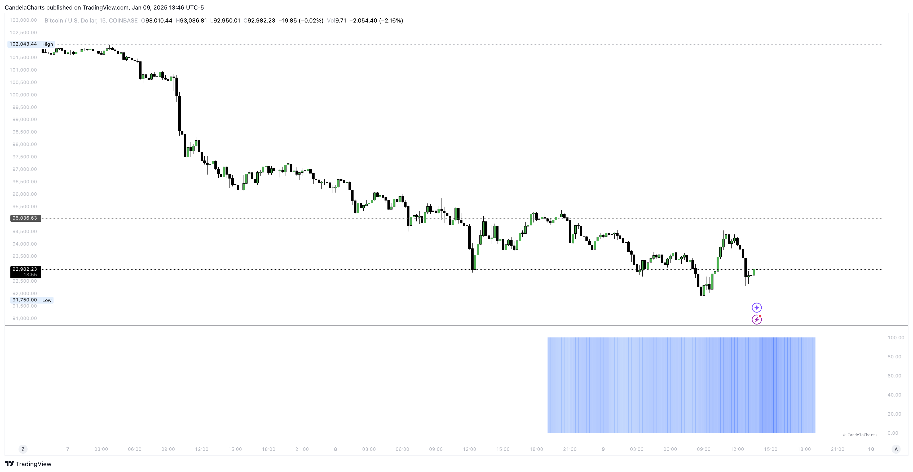

# Overview

<figure><figcaption></figcaption></figure>

Enhance your TradingView toolkit with the **OHLC Volatility Range Map**—a sophisticated indicator designed to provide actionable insights for refined trading strategies.


[themes.md](themes.md)



[visualization.md](visualization.md)



[calculation.md](calculation.md)



[statistics.md](statistics.md)


Breaking away from traditional OHLC visualizations, this advanced tool harnesses volatility principles and Inner Circle Trader (ICT) concepts to analyze accumulation, manipulation, and distribution dynamics.&#x20;

It delivers a detailed, candle-by-candle breakdown, offering a deeper understanding of price behavior in volatile market conditions.
