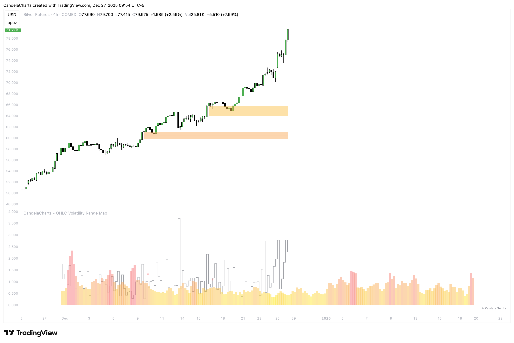

# Statistical PD Arrays

The **OHLC Volatility Range Map** now incorporates **Statistical PD Arrays** for a more detailed analysis of market behavior.

<figure><figcaption></figcaption></figure>

At present, we support the following types of imbalances:

* **Fair Value Gaps (FVG)**
* **Inversion Fair Value Gaps (IFVG)** 🔜 _(coming soon)_

These imbalances can also be filtered by **volatility intensity**, enabling users to focus on areas of the market that match their preferred risk and activity levels.
