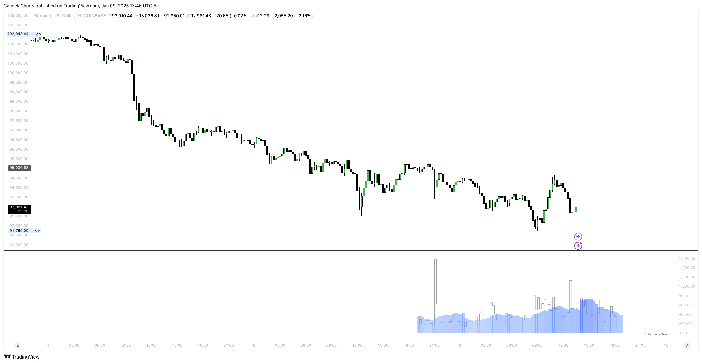

# Statistics

The **OHLC Volatility Range Map** is a sophisticated tool that enhances candlestick analysis by incorporating statistical levels based on the Open, High, Low, and Close values of each candle.&#x20;

<figure><figcaption></figcaption></figure>

This advanced indicator focuses on identifying high and low volatility zones, offering traders a more nuanced perspective on market behavior and price action dynamics.

#### Volatility Zones for Precision Trading

Volatility is a key driver of market behavior, reflecting the intensity and unpredictability of price movements. The OHLC Volatility Range Map highlights high and low volatility zones within candlestick data, enabling traders to refine their strategies based on market conditions.

### **High Volatility Zones**

High volatility zones are characterized by significant price fluctuations and wide candlestick ranges. These zones often signal:

* **Breakout Potential**: High volatility frequently precedes or accompanies major market moves, offering opportunities to capitalize on strong trends.
* **Increased Risk**: The potential for sharp price reversals or rapid movements demands greater caution and tighter risk management.
* **Liquidity Events**: High volatility zones often coincide with periods of high trading volume, signaling areas of strong market interest.

### **Low Volatility Zones**

Low volatility zones exhibit tighter price ranges and subdued market activity. These zones often indicate:

* **Consolidation**: Periods where the market is indecisive, typically leading to accumulation or distribution phases.
* **Trend Reversals**: Low volatility can precede significant price movements as market participants prepare for the next directional move.
* **Reduced Risk**: Limited price fluctuations make these zones ideal for tighter stop-loss placements and precise entries.

### Why Use the OHLC Volatility Range Map?

By continuously identifying and analyzing high and low volatility zones, this tool allows traders to:

* **Optimize Entry and Exit Points**: Recognize areas of market expansion and contraction.
* **Enhance Risk Management**: Adjust strategies based on volatility conditions.
* **Adapt to Market Dynamics**: Stay ahead of market shifts by understanding volatility trends.

The **OHLC Volatility Range Map** empowers traders to navigate complex market environments with precision, providing actionable insights for both trending and ranging markets.&#x20;

Whether the goal is to capture breakout opportunities in high volatility or secure stable trades in low volatility zones, this tool is an essential addition to any trader’s arsenal.
