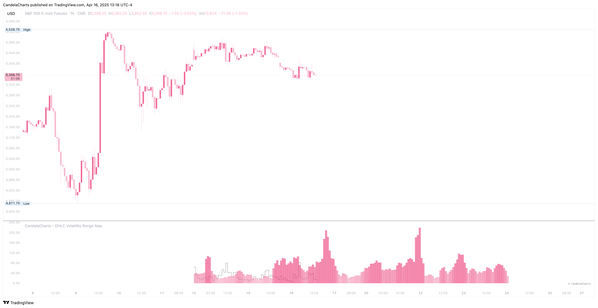

# Themes

<figure><figcaption></figcaption></figure>

The OHLC Volatility Range Map offers a variety of thematic visualizations designed to enhance the user experience and cater to different preferences. These themes include:

1. **Default** – The standard theme, providing a balanced and neutral presentation of data.
2. **Blue** – A calming and cool-toned theme that highlights data with shades of blue.
3. **Green** – A fresh and vibrant theme, ideal for showcasing data with green hues.
4. **Indigo** – A sophisticated theme featuring deep indigo tones for a more refined look.
5. **Purple** – A rich, luxurious theme utilizing various purple shades to provide a striking visual.
6. **Pink** – A playful and soft theme with varying shades of pink for a warm touch.
7. **Orange** – A dynamic and energetic theme featuring bright orange tones for a bold presentation.
8. **Red** – A fiery and attention-grabbing theme, perfect for emphasizing critical data points with red hues.
9. **Gray** – A sleek and minimalist theme using shades of gray for a professional, neutral aesthetic.
10. **Cyan** – A refreshing and bright theme incorporating cyan tones for a vibrant display.
11. **Teal** – A serene and modern theme blending teal shades to offer a peaceful yet engaging visual experience.
12. **Brown** – A warm, earthy theme that uses shades of brown for a grounded and natural look.
13. **Custom** – A fully customizable theme, allowing users to personalize their color scheme and design according to their specific needs and preferences.

These diverse themes cater to a wide range of visual styles, enabling users to choose the one that best suits their analytical or aesthetic needs.
