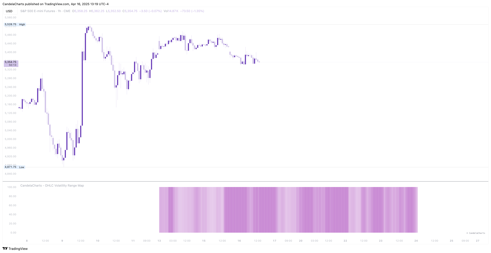

# Visualization

The OHLC Volatility Range Map offers two distinct visualization modes, each designed to present data in a unique and insightful way:

### **Barchart**

This mode displays data using vertical bars, offering a clear and intuitive representation of the volatility range across various timeframes. It is ideal for users who prefer a straightforward, numerical approach, enabling easy comparison between individual data points. 

<figure><figcaption></figcaption></figure>

Additionally, the Barchart mode includes an option to highlight the **current volatility**, providing real-time insights into the present market conditions and allowing users to quickly assess ongoing volatility levels.

### **Heatmap**

The heatmap visualization mode uses color gradients to represent the intensity of volatility across different price ranges. This mode is particularly useful for quickly identifying trends and patterns, as varying color intensities highlight areas of high and low volatility.&#x20;

<figure><figcaption></figcaption></figure>

It’s an excellent option for those who prefer a more visual and intuitive approach, making it easier to spot significant fluctuations at a glance.

Together, these two visualization modes provide users with flexible and dynamic ways to analyze OHLC volatility data, catering to different analytical preferences and offering both numerical precision and visual clarity.
