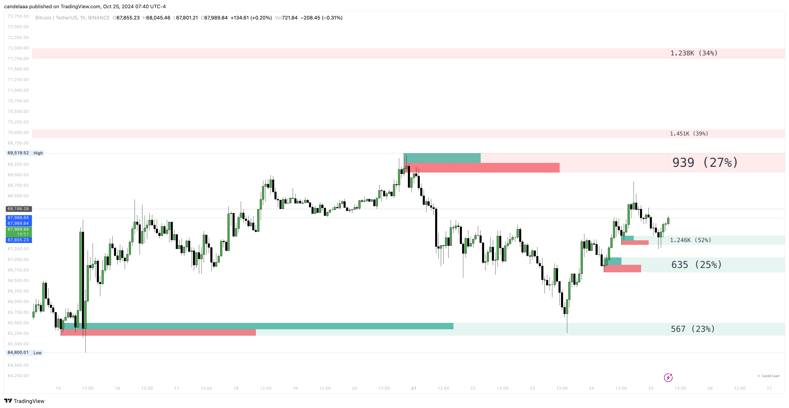

# Order Blocks

Order Blocks are categorized into two types: Bullish Order Blocks and Bearish Order Blocks. Bullish Order Blocks typically form near swing lows and are considered potential support zones.

Conversely, Bearish Order Blocks usually appear near swing highs and are regarded as potential resistance areas.

<figure><figcaption></figcaption></figure>

To display longer-term Order Blocks, users can adjust the Length setting in the Order Blocks section. This setting determines the lookback period used for detecting swing points, which in turn constructs the Order Blocks.


The toolkit showcases internal activity and metrics based on volume data.

