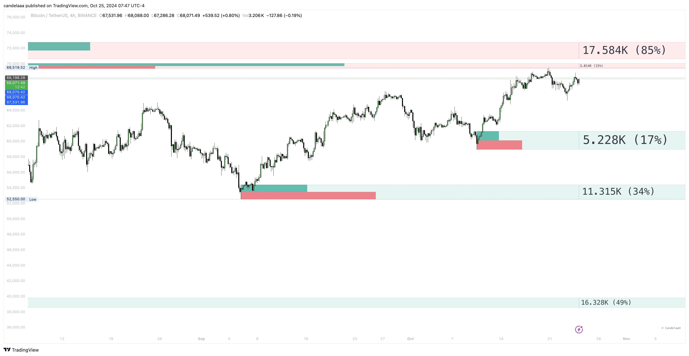

# Swing Order Blocks

A swing order block represents a key area on a price chart where significant order accumulation is believed to have occurred.

<figure><figcaption></figcaption></figure>

These zones are critical for traders, as they suggest areas where major market participants have placed large buy or sell orders.

The accumulation of these orders can exert considerable influence on future price movements, making swing order blocks valuable for identifying potential support or resistance levels.

Traders often base their decisions on these areas, anticipating that the presence of concentrated orders will impact the direction and strength of price trends.


The toolkit showcases internal activity and metrics based on volume data.

