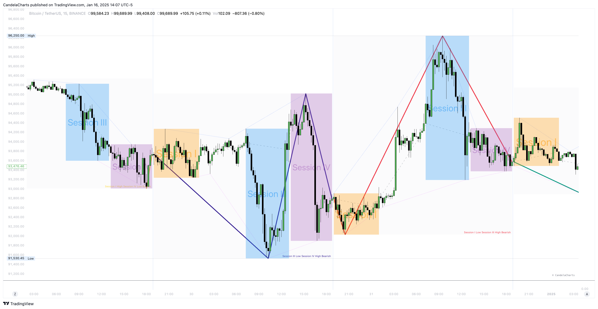

# ICT Daily Profiles

ICT Daily Profiles provide a systematic framework for analyzing market behavior across various intraday sessions, enabling traders to align their strategies with recurring patterns and tendencies observed within a single trading day.

The ICT Daily Profiles toolkit encompasses all possible high/low combinations that can occur within a single day, offering a more comprehensive approach compared to ICT's primary focus on the London and NY sessions.

<figure><figcaption></figcaption></figure>

**ICT Daily Profiles**

* Session I High Session II Low Bearish
* Session I High Session III Low Bearish
* Session I High Session IV Low Bearish
* Session II High Session III Low Bearish
* Session II High Session IV Low Bearish
* Session III High Session IV Low Bearish
* Session I Low Session II High Bullish
* Session I Low Session III High Bullish
* Session I Low Session IV High Bullish
* Session II Low Session III High Bullish
* Session II Low Session IV High Bullish
* Session III Low Session IV High Bullish
* Session I High Session I Low Bearish _(same session H/L)_
* Session I Low Session I High Bearish _(same session H/L)_
* Session II High Session II Low Bearish _(same session H/L)_
* Session II Low Session II High Bearish _(same session H/L)_
* Session III High Session III Low Bearish _(same session H/L)_
* Session III Low Session III High Bearish _(same session H/L)_
* Session IV High Session IV Low Bearish _(same session H/L)_
* Session IV Low Session IV High Bearish _(same session H/L)_


ICT Daily Profiles - [https://pbs.twimg.com/media/Ghb-WM8WwAAyjQF?format=jpg\&name=4096x4096](https://pbs.twimg.com/media/Ghb-WM8WwAAyjQF?format=jpg\&name=4096x4096)


