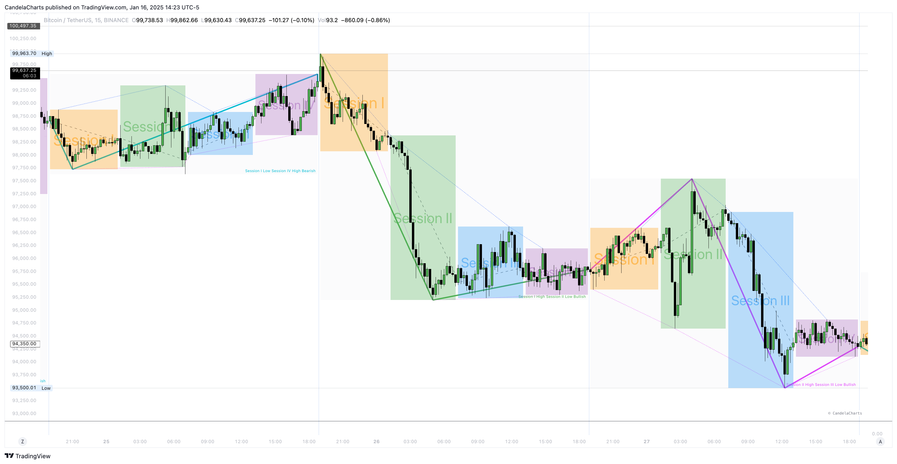

# Overview

ICT Daily Profiles is a premium toolkit derived from the ICT Intraday Profiles methodology, designed to provide traders with in-depth insights into market behavior under specific conditions.&#x20;

By leveraging the principles outlined in the ICT Intraday Profiles video series—available here:

* [ICT Intraday Profiles](https://www.youtube.com/watch?v=eU8WcUftUtY\&list=PLVgHx4Z63paZrCT5EaUhJ6sCVNaegCf_c) (London)
* [ICT Intraday Profiles](https://www.youtube.com/watch?v=P5pyzmgZA1s\&list=PLVgHx4Z63paZdnxymLp2Ihj-Pc_-foVVV) (NY)

This toolkit offers a structured approach to analyzing daily price action.

<figure><figcaption></figcaption></figure>

The tool focuses on identifying recurring patterns and behavioral tendencies in financial markets, enabling traders to anticipate key movements, refine their strategies, and make informed decisions.&#x20;

Whether you are a seasoned professional or a developing trader, ICT Daily Profiles provides actionable frameworks to enhance your understanding of price dynamics and improve your intraday trading performance.
