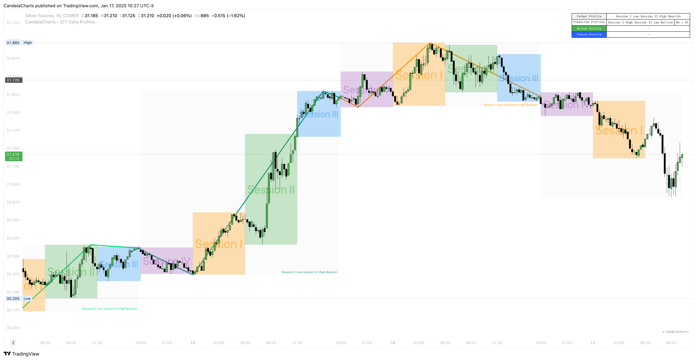

# Scanner

<figure><figcaption></figcaption></figure>

The ICT Daily Profiles tool is a robust scanner designed to enhance trading insights through the following profile types:

**Former Profile**\
Provides the detected profile from the previous day, serving as a reference for analyzing past market behavior and identifying recurring patterns.

**Predicted Profile**\
Utilizes advanced daily profile detection algorithms to generate forward-looking profiles, helping traders anticipate potential market movements.

**Actual Profile**\
Offers a real-time representation of the current daily profile, enabling traders to track market activity as it happens.

**Future Profile**\
Employs the Markov Chain statistical method to project future market behavior, delivering a probabilistic outlook to support strategic planning.

By integrating historical data, predictive analytics, real-time monitoring, and statistical projections, the ICT Daily Profiles tool empowers traders with a comprehensive approach to market analysis and decision-making.
