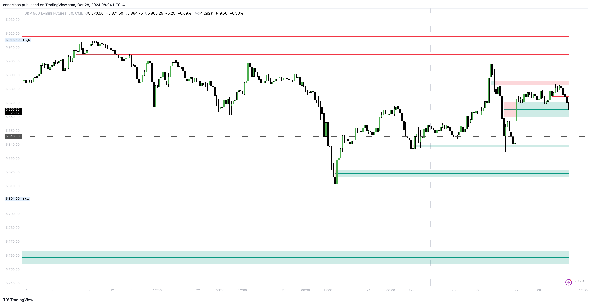

# Balanced Price Range

The Balanced Price Range is a key concept in understanding how price behaves around certain levels that represent equilibrium or "fair value" in the market.&#x20;

<figure><figcaption></figcaption></figure>

The idea behind BPR is to identify price ranges where both buying and selling pressures are balanced, indicating a period of consolidation or price acceptance.&#x20;

In practice, it often shows up in areas where market makers have accumulated positions, and the price tends to oscillate around a central or equilibrium level.
