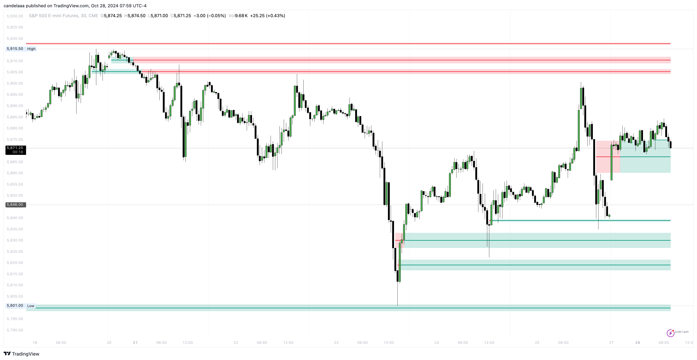

# Inversion Fair Value Gaps

Inverse Fair Value Gaps (FVGs) are essentially mitigated Fair Value Gaps that can serve as potential retest areas.

<figure><figcaption></figcaption></figure>

When a bullish Fair Value Gap is mitigated, it creates a bearish Inverse Fair Value Gap, indicating that the price might retrace upward to retest the area.&#x20;

Conversely, a mitigated bearish Fair Value Gap results in a bullish Inverse Fair Value Gap, suggesting that the price could retrace downward to retest the area.
