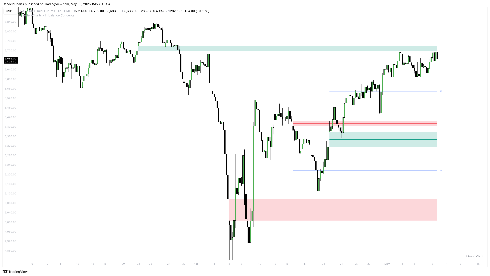

# New Day Opening Gap

The ICT New Day Opening Gap (NDOG) refers to the price gap between the closing price at 5:00 PM EST and the opening price at 6:00 PM EST in the New York trading session. This one-hour break occurs daily from Monday through Thursday due to a temporary halt in trading activity.

<figure><figcaption></figcaption></figure>

These opening gaps are significant because they often act like a magnet for price action—meaning the market tends to revisit and "fill" these gaps. This behavior is rooted in the concept of fair value gaps, as introduced by ICT (Inner Circle Trader), making NDOGs valuable for identifying high-probability trading setups.

### Consequent Encroachment of NDOG

**Consequent Encroachment** refers to the **50% retracement level**—the midpoint of the New Day Opening Gap. This level is known to be one of the most reactive price points and can be used to anticipate strong market reactions such as reversals or rejections.

To calculate the Consequent Encroachment:

* Use a Fibonacci retracement tool.
* Set the levels to **0, 0.5, and 1**.
* Draw the tool from the low to the high of the NDOG.

This 50% level can be a powerful area of interest for traders, acting as a precise entry or exit point.

### How to Use ICT NDOG

ICT recommends marking at least **five NDOGs**—one for each trading day from Monday through Friday—on your chart. These gaps provide insight into the **true fair value** of the asset and often act as:

* **Support and resistance zones**
* **Liquidity draw areas**
* **Price rejection or accumulation zones**

By tracking these levels consistently, traders can gain a deeper understanding of market behavior, identify optimal entry points, and improve trade timing.
