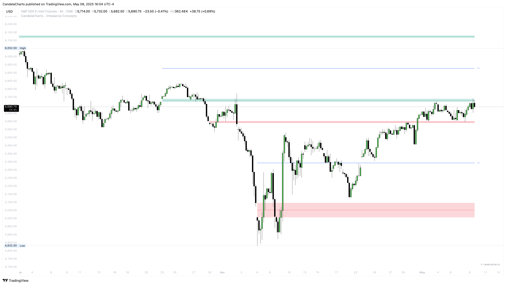

# New Week Opening Gap

The ICT New Week Opening Gap (NWOG) refers to the price gap between the closing price on Friday at 4:59 PM EST and the opening price on Sunday at 6:00 PM EST. This gap typically forms due to external factors such as geopolitical events, economic news, or unexpected developments over the weekend, which can lead to significant price shifts when the market reopens.

<figure><figcaption></figcaption></figure>

The NWOG highlights a period where **no trading activity occurs**—from the Friday market close to the Sunday market open—creating a **liquidity void**. This gap represents a disconnection in price action and is considered a **fair value gap** by ICT (Inner Circle Trader) standards.

To identify a NWOG:

* Mark the **Friday closing price at 4:59 PM EST**.
* Mark the **Sunday opening price at 6:00 PM EST**.
* The difference between these two price levels is the **New Week Opening Gap**.

This gap often acts as a **magnet for price**, with the market typically revisiting and "filling" it as part of price rebalancing.

### Consequent Encroachment of NWOG

The **Consequent Encroachment** is the **50% retracement level** of the NWOG and is known to be one of the most reactive price levels. It frequently serves as a point of **support, resistance, or reversal**.

To measure it:

* Use the **Fibonacci retracement tool** with levels set at **0, 0.5, and 1**.
* Apply it from the **low to high of the NWOG**.
* The **0.5 level** represents the **midpoint**, or **consequent encroachment**, which traders monitor for potential reactions.

### Why Do ICT NWOGs Occur?

Because the market is closed during the weekend, any impactful event—such as **wars, natural disasters, or changes in economic policy**—can cause price to open significantly higher or lower than where it closed on Friday. This dislocation results in a visible price gap at the weekly open, creating an **imbalance** that the market often seeks to correct.

### How to Use ICT NWOG

According to ICT principles, traders should mark at least **four recent weekly opening gaps** on their charts. These NWOGs can provide:

* **Fair value references**
* **Support and resistance levels**
* **Liquidity draw zones**
* **Areas of price accumulation or rejection**

By incorporating NWOG analysis into your trading strategy, you can gain deeper insight into institutional behavior and improve your market timing.
