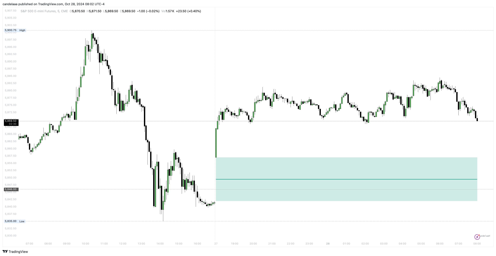

# Opening Gaps

Opening Gaps are market imbalances identified by two consecutive candles with non-overlapping wicks, creating a visible gap or empty area.&#x20;

<figure><figcaption></figcaption></figure>

These imbalances are frequently observed in stocks and in shorter timeframes of cryptocurrencies and forex pairs.
