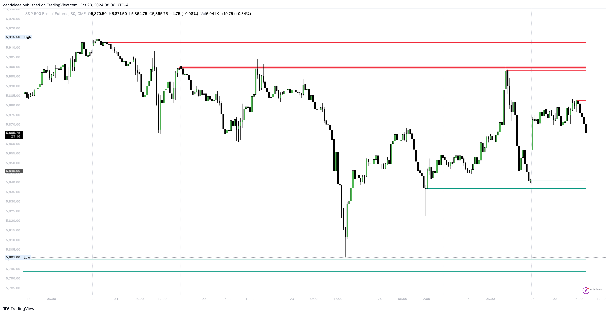

# Volume Imbalance

Volume Imbalances occur when two consecutive candles have non-overlapping bodies, but their wicks do overlap.

<figure><figcaption></figcaption></figure>

These imbalances are typically observed in stocks or in shorter timeframes of cryptocurrencies and forex pairs.
