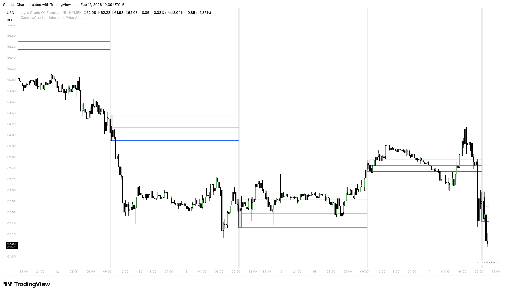

# Session Opening

### The Opening Range Strategy 

The opening minutes of a major financial center (like London or New York) set the tone for the entire session. The **Initial Balance** or **Opening Range** is often used by traders to define the day's bias.

<figure><figcaption></figcaption></figure>

This tool automatically highlights this critical period and draws the key reference levels for you.

### Key Levels 

We visualize the "Battlefield" of the opening session:

* **Session High**: The highest price reached during the opening minutes.
  * _Usage_: Often acts as intraday resistance. A clean break above this can signal a "Trend Day" upwards.
* **Session Low**: The lowest price reached during the opening minutes.
  * _Usage_: Often acts as intraday support. A clean break below this can signal a "Trend Day" downwards.
* **Session Mid**: The average price of the opening range.
  * _Usage_: Acts as a "Fair Value" reference. If price is above, bulls are in control. If below, bears are in control.
