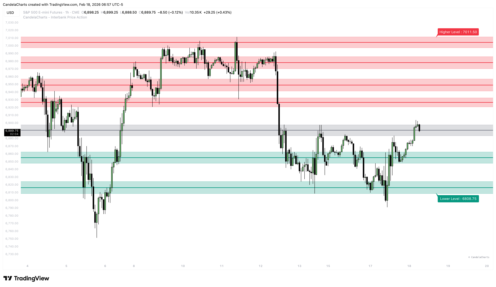
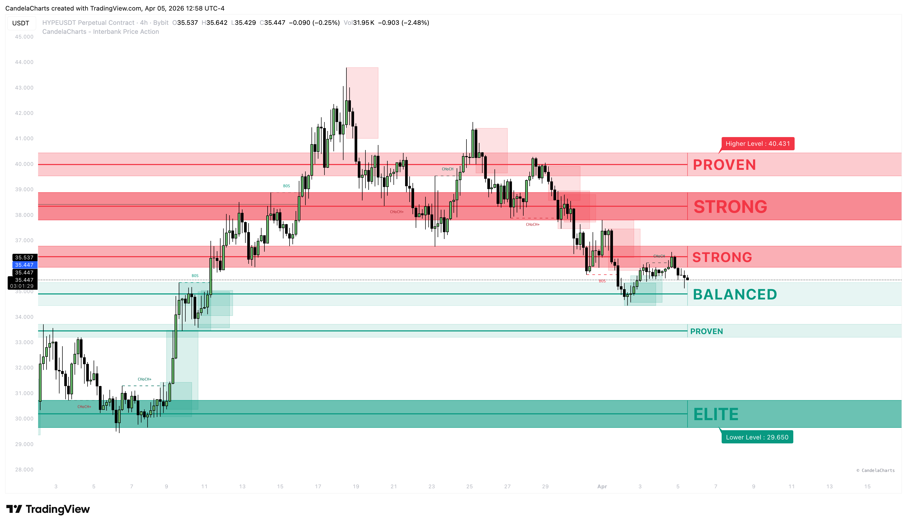

# Support & Resistance

### Automated Level Detection 

Drawing Support and Resistance (S/R) lines can be subjective and tedious. This tool automates the process by scanning historical price action to find "clusters" where price has reacted multiple times.

<figure><figcaption></figcaption></figure>

It doesn't just draw lines; it identifies **High-Probability Zones** where liquidity and orders are stacked.

### Rank Hierarchy

The **Interbank Price Action** indicator uses a sophisticated ranking system for Support and Resistance (S/R) levels. Unlike traditional pivot markers, these ranks are dynamically calculated based on historical significance and price interaction density.

<figure><figcaption></figcaption></figure>

#### The Ranking Logic

The indicator evaluates every potential S/R zone based on two primary factors:

1. **Pivot Density**: The number of major swing highs and lows that fall within the zone's price range.
2. **Price Interaction (Hits)**: The number of times the price (OHLC) has interacted with the zone over the last 500 candles.

Levels are sorted by their composite strength score, and the top-performing levels are assigned a **Rank Name**.

#### Rank Hierarchy

The hierarchy defines the reliability and expected "bounce" probability of a level.

<table><thead><tr><th width="111.10064697265625">Rank</th><th width="116.560791015625">Name</th><th>Description</th></tr></thead><tbody><tr><td><strong>#1</strong></td><td><code>ELITE</code></td><td>The highest-strength level on the chart. Typically represents a major historical turning point with extreme price confluence.</td></tr><tr><td><strong>#2 - #3</strong></td><td><code>STRONG</code></td><td>Highly reliable levels that have survived multiple tests. These are your primary zones for high-conviction entries.</td></tr><tr><td><strong>#4 - #5</strong></td><td><code>PROVEN</code></td><td>Established levels with a track record. They act as solid foundations for trend continuation or standard pullbacks.</td></tr><tr><td><strong>#6 - #8</strong></td><td><code>BALANCED</code></td><td>Moderate levels that represent fair value areas or secondary consolidation zones.</td></tr><tr><td><strong>#9+</strong></td><td><code>WEAK</code></td><td>Minor levels or newly forming zones. Use these with caution as they are more prone to being swept.</td></tr></tbody></table>

#### How to Trade the Ranks

**1. The "Elite" Magnet**

The `ELITE` level often acts as a major magnet for price. If price is approaching an Elite level after a long trend, expect a significant reaction (either a sharp reversal or a high-volume breakout).

**2. Confluence with "Strong" Zones**

Look for entries where a `STRONG` level aligns with other concepts like **Killzones** or **Order Blocks**. A Strong level provides the "floor" or "ceiling" needed to confirm institutional interest.

**3. "Proven" for Stop Placement**

`PROVEN` levels are excellent for placing stop losses or trailing stops. Because the market has recognized these levels multiple times, price is less likely to breach them without a genuine change in trend.

**4. Scalping "Balanced" Levels**

If you are a scalper or intraday trader, `BALANCED` levels provide excellent targets for taking partial profits (TP1/TP2) as price often pauses or consolidates briefly at these zones.


**Dynamic Updating**: Remember that ranks are dynamic. A level that is currently `STRONG` may become `ELITE` if price continues to respect it, or it may drop in rank if it is repeatedly "chopped" through without reaction.



Always check the **Hit Count** in the level's tooltip. A `PROVEN` level with high hit counts is often safer than a `STRONG` level that was only established recently.


### How It Works 

1. **Scan**: The script looks back over a defined period (Loopback) to find every Pivot High and Pivot Low.
2. **Cluster**: It analyzes where these pivots stack up at the same price level.
3. **Qualify**: Only levels with a high density of touches are kept. Weak, random levels are filtered out.
4. **Visualize**: The strongest levels are drawn as horizontal zones extending to the right.

### Customization 

#### 1. Loopback Period 

* **Short**: Finds S/R levels based on recent price action (good for scalping).
* **Long**: Finds major historical S/R levels that have been respected for a long time (good for swing trading).

#### 2. Zone Attributes 

* **Channel Width**: Controls the vertical thickness of the S/R zone.
  * _Tip_: Increase this slightly for volatile assets (like Crypto) to catch wicks.
* **Strength Threshold**: The filter for quality.
  * _Higher Value_: Shows fewer zones, but they are very significant.
  * _Lower Value_: Shows more zones, capturing minor supports.

#### 3. Visuals 

* **Colors**: Resistance is Red, Support is Blue/Green (customizable).
* **Mean Line**: Draws a thin line through the center of the zone for precision entries.
* **Labels**: Displays the exact price level on the chart scale so you can set your alerts or limit orders easily.
