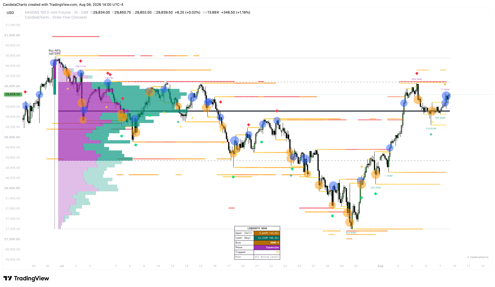

# Order Flow Concepts™

The **CandelaCharts - Order Flow Concepts** toolkit is a comprehensive suite designed to visualize institutional activity, volume anomalies, and resting liquidity directly on your TradingView chart.

<figure><figcaption></figcaption></figure>

Rather than relying purely on price action, this toolkit looks under the hood of the market. It tracks how volume is distributed (Volume Profiles), where large resting orders are likely clustered (Liquidity Pools), where buyers or sellers are aggressively stepping in but failing to move price (Absorption), and where retail traders are getting caught on the wrong side of the market (Trapped Traders).

By aggregating these data points, the toolkit provides an on-chart Dashboard that calculates the "Gravity" or "Time-Weight" of resting liquidity, giving you a clear, data-driven bias for where the market is most likely to move next.
