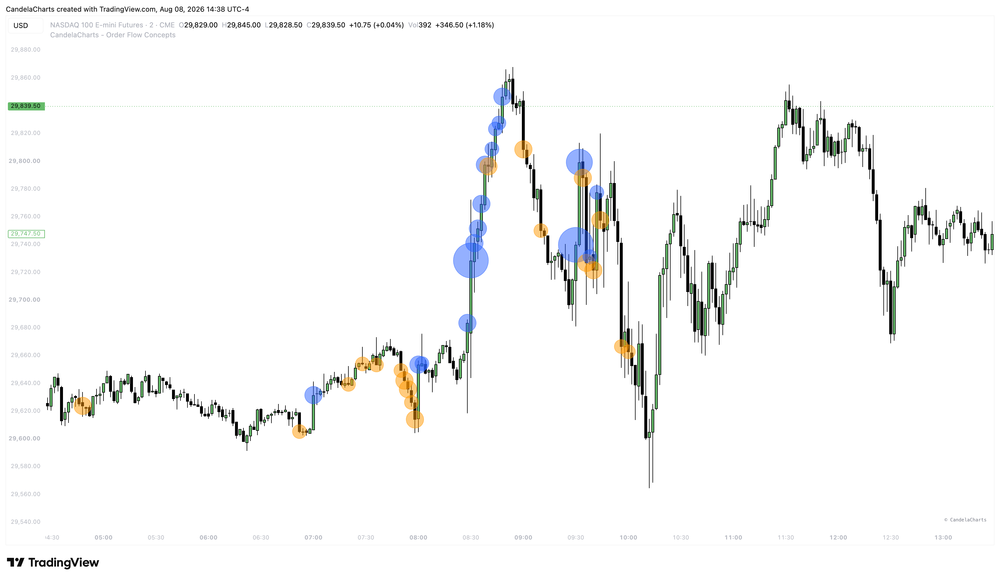

# Big Order Bubbles

Big Order Bubbles (BOBs) provide a simple but highly effective way to visualize exceptionally large, single-bar volume injections directly on your chart.

<figure><figcaption></figcaption></figure>

While the Volume Anomalies feature looks for specific behaviors (like absorption or exhaustion), Big Order Bubbles simply highlight raw, massive participation. When a bubble appears, you know that significant institutional money has just stepped into the market.

### Configuration

* **Show Bubbles**: Master toggle to enable or disable the drawing of volume bubbles on the chart.
* **Multiplier**: This setting defines how large the volume must be relative to the average baseline to trigger a bubble.
  * For example, a multiplier of `3.0` means the volume on that specific candle must be at least 300% of the recent average volume.
  * You can adjust this in `0.5` increments. Higher values will filter out the noise and only show true climax volume, while lower values will highlight more frequent participation.

### Trading Context

Big Order Bubbles are best used as confirmation tools rather than standalone signals.

* If price sweeps a major liquidity pool, prints a Volume Anomaly (like Exhaustion), and then begins displacing away with a **Big Order Bubble** and Stacked Imbalances, you have maximum confluence that a major reversal is underway.
