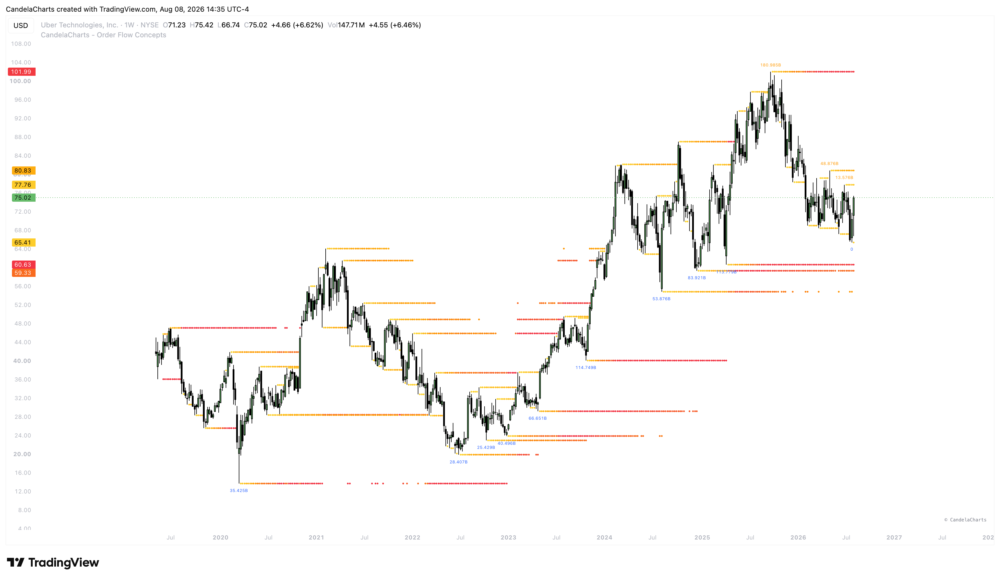

# Liquidity Pools

<figure><figcaption></figcaption></figure>

The Liquidity Pools component tracks historical and active liquidity pools. It identifies key swing highs and lows across multiple time horizons, calculates the volume or money accumulated at those levels, and visualizes them on your chart so you can see exactly where price is likely to be drawn.

### Visualizing Liquidity

* **Show Liquidity Pools**: Master toggle to enable or disable the drawings.
* **Plotting Mode (Drawing Style)**:
  * **Heatmap Blocks**: Plots historical heatmap cells (limited to \~500 boxes due to TradingView drawing limits). This provides a rich, color-coded visual of liquidity density over time.
  * **Dotted Lines**: Plots continuous dotted lines across the entire available dataset, overcoming the 500-box limit but without the historical depth visualization.
* **Show Labels**: Optionally display the total accumulated volume (or money) directly on the active liquidity swings.
* **Calculation Type (Volume vs Money)**: Choose whether the labels and aggregations calculate raw traded `Volume` or total traded `Money` (Volume \* Price).

### Time Horizons (Lookbacks)

The indicator scans for liquidity pools across three distinct time horizons, requiring broader price extremes to form longer-term levels:

* **Fast**: Lookback period (in bars) used to detect short-term liquidity highs and lows. These are frequently swept.
* **Mid**: Lookback period for medium-term liquidity. These represent structural swing points.
* **Slow**: Lookback period for major liquidity pools. These are macro magnets that often dictate the daily or weekly trend.

### Management and Mitigation

* **Max Age**: Defines the maximum number of bars a stored liquidity level can remain active before it is considered "stale" and removed from memory.
* **Remove On (Mitigation)**:
  * **Wick**: A level is considered mitigated (and therefore removed) as soon as price wicks through it.
  * **Close**: A level is only mitigated after a candle successfully closes beyond it.

### Heatmap Configuration

When using the "Heatmap Blocks" plotting mode, you can customize the rendering:

* **Lookback**: Number of recent bars used to measure the price range that determines each heatmap box height. Higher values produce a more slowly changing vertical scale.
* **Resolution**: Number of vertical divisions across the measured price range. Higher values make each liquidity heatmap band thinner and more precise.
* **Cell Width**: Horizontal width of each historical heatmap box, measured in chart bars. Higher values create longer cells and result in fewer color updates, reducing chart clutter.
