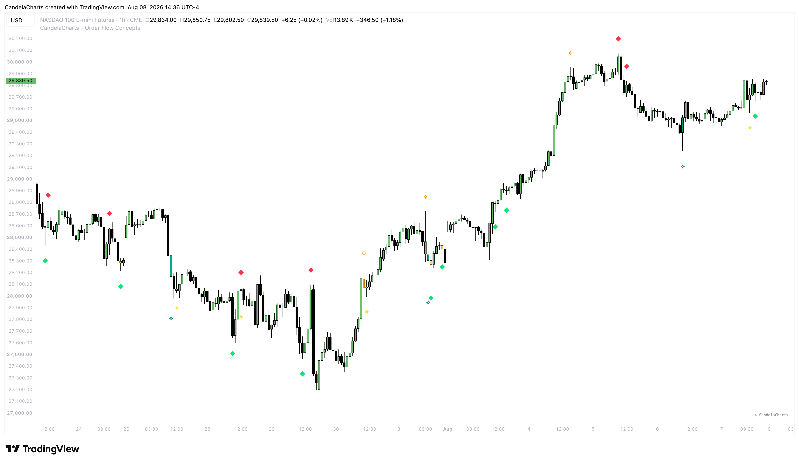

# Volume Anomalies

<figure><figcaption></figcaption></figure>

Volume Anomalies are visual markers that highlight candles exhibiting abnormal volume behavior relative to their price progress. These anomalies often precede significant reversals and are critical for confirming when a liquidity sweep is genuine.

### Core Concepts

The model calculates an average baseline volume over a defined **Lookback** period. An anomaly is flagged when the volume of a specific candle exceeds this baseline by your configured multipliers.

#### 1. Absorption

Absorption occurs when there is exceptionally high volume, but the candle itself makes very little price progress. This indicates that aggressive market orders (buying or selling) are being absorbed by large limit orders from institutions building a position.

* **Absorption Multiplier**: The multiplier against average volume required to trigger the anomaly (e.g., `2.0x`).
* **Max Body %**: The maximum allowed body size as a percentage of the total candle range. If the body is too large, price is progressing, so it is not absorption. A tight body with massive volume confirms absorption.

#### 2. Exhaustion

Exhaustion occurs when price pushes aggressively in one direction on climax volume, but is immediately rejected, leaving a massive wick. It represents the final "blow-off" top or bottom before a reversal.

* **Exhaustion Multiplier**: The multiplier against average volume required to qualify (e.g., `2.5x`). It typically requires higher relative volume than absorption.

#### 3. Trapped Traders

This anomaly flags moments where retail traders are baited into a breakout, only for the market to immediately reverse and trap them on the wrong side. It requires a high-volume breakout candle, followed quickly by a reversal.

* **Trapped Traders Multiplier**: The volume multiplier required on the initial "bait" candle.
* **Max Trap Bars**: The maximum number of bars allowed for the reversal to occur and confirm the trap. If the reversal takes too long, the trap is invalid.
* **Display On**: Choose where the visual marker is drawn:
  * **Bait Candle**: Retroactively draws the marker on the initial high-volume candle where the traders were trapped.
  * **Confirming Candle**: Draws the marker on the current candle that actually confirmed the trap by reversing.
