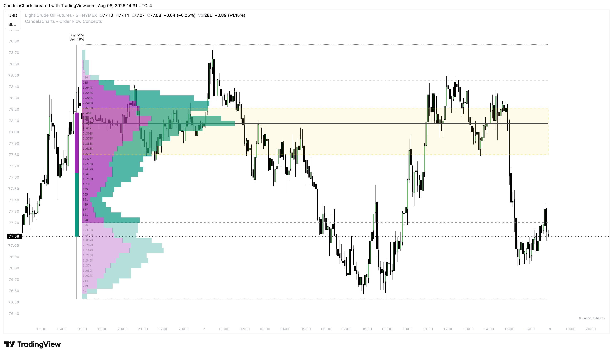

# Volume Profiles

<figure><figcaption></figcaption></figure>

The Volume Profiles component visualizes Higher Timeframe (HTF) volume distribution directly on your chart, helping you identify where the most trading activity has occurred over a specified period.

### Profile Type

You can choose how the volume data is calculated and displayed:

* **Buy/Sell**: Displays the total volume, optionally split into buying and selling volume (based on intrabar price movement) if available.
* **Delta**: Displays the net difference between buying and selling volume, highlighting whether buyers or sellers were more aggressive at a specific price level.

### Profile Mode

This determines how the volume profiles are anchored to the chart:

* **Continuous**: Draws a single, constantly updating volume profile that spans the entire lookback period. This is useful for identifying the macro Point of Control (POC).
* **Spaced**: Draws multiple individual volume profiles separated by a defined interval (e.g., one profile per day or per week). This helps you see how value is shifting over time.

### Value Area (VA)

The Value Area highlights the price range where a specified percentage of the total volume was traded.

* **Value Area %**: The default is 70%, meaning the shaded area represents where 70% of the trading activity took place. Price levels outside this area are considered unfair value.
* **In/Out VA Transparency**: You can independently adjust the opacity of the profile bars inside the Value Area versus outside it, making the high-volume nodes stand out visually.

### Granularity and Range

* **Resolution (Bins)**: Controls how many horizontal rows the profile is divided into. Higher values (e.g., 50 or 100) provide more granular price levels, while lower values smooth the data into broader zones.
* **Number of Profiles**: When using "Spaced" mode, this determines how many historical profiles to display on the chart.
* **Show Initial Range (ITR)**: Optionally highlights the initial price range established at the start of the profile period, useful for opening range breakout strategies.
* **Show Row Values**: Displays the exact numerical volume data inside each row of the profile.
