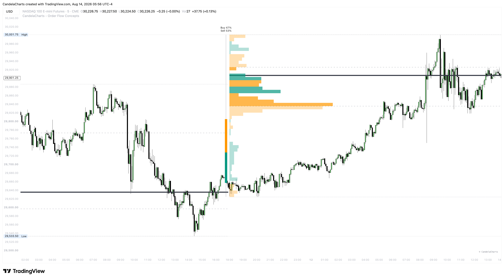
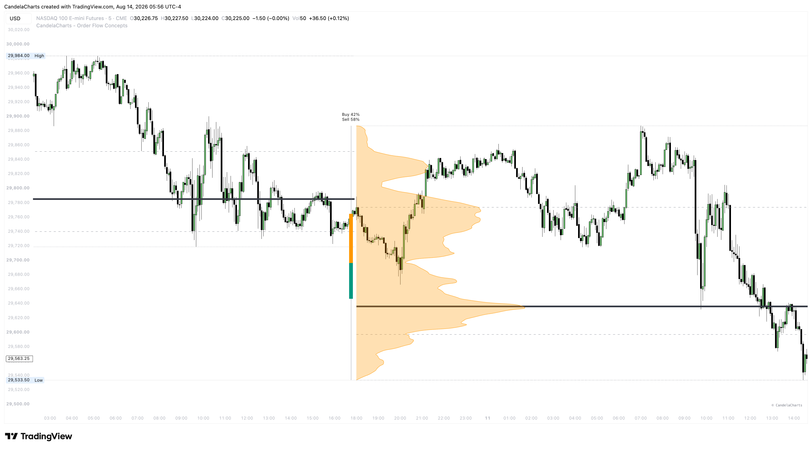
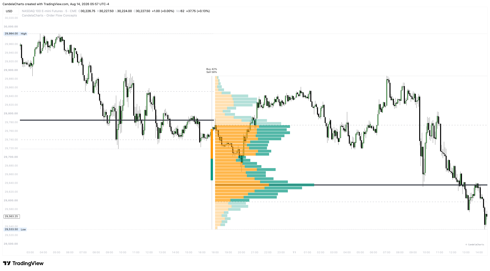
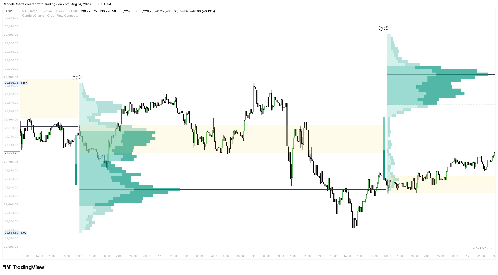
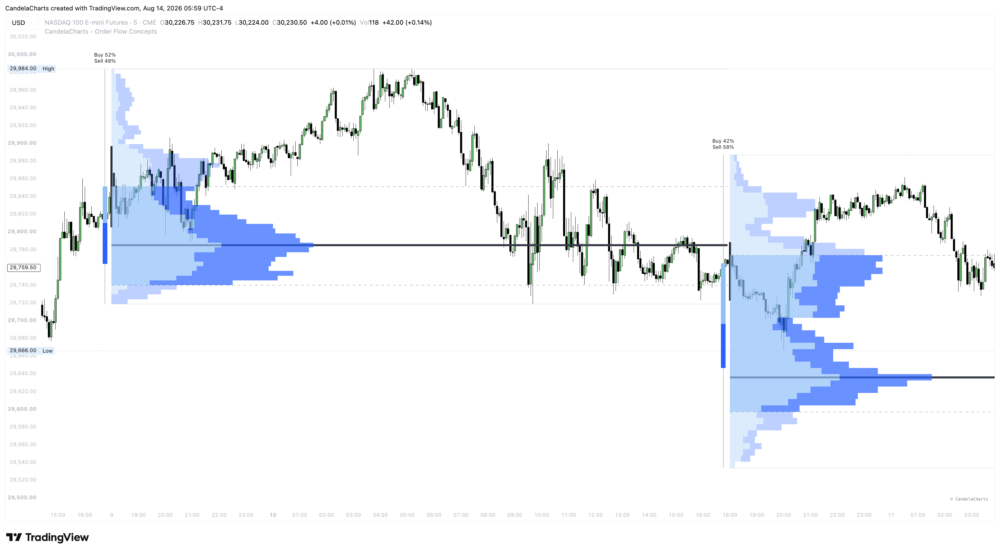

# Volume Profiles

The Volume Profiles component visualizes Higher Timeframe (HTF) volume distribution directly on your chart, helping you identify where the most trading activity has occurred over a specified period.

#### Profile Type

You can choose how the volume data is calculated and displayed:

* **Buy/Sell**: Displays the total volume, optionally split into buying and selling volume (based on intrabar price movement) if available.

<figure><figcaption></figcaption></figure>

* **Delta**: Displays the net difference between buying and selling volume, highlighting whether buyers or sellers were more aggressive at a specific price level.

<figure><figcaption></figcaption></figure>

#### Profile Mode

This determines the visual rendering style of the volume profiles:

* **Solid**: Draws the traditional continuous block histogram for the volume profile.

<figure><figcaption></figcaption></figure>

* **Outline**: Draws a continuous polyline outlining the shape of the volume profile for a cleaner, minimalist look.

<figure><figcaption></figcaption></figure>

* **Spaced**: Draws the volume profile using separated, slightly gapped rows to clearly distinguish each price bin.

<figure><figcaption></figcaption></figure>

#### Initial Range (ITR)

Highlights the initial price range established at the start of the profile period, which is useful for opening range breakout strategies. You can choose how this is displayed:

* **None**: Disables the initial range visual.
* **Zone**: Draws a shaded background box representing the range.

<figure><figcaption></figcaption></figure>

* **Line**: Draws a clean, single vertical line at the start of the profile spanning the initial range's high and low.

<figure><figcaption></figcaption></figure>

#### Value Area (VA)

The Value Area highlights the price range where a specified percentage of the total volume was traded.

* **Value Area %**: The default is 70%, meaning the shaded area represents where 70% of the trading activity took place. Price levels outside this area are considered unfair value.
* **In/Out VA Transparency**: You can independently adjust the opacity of the profile bars inside the Value Area versus outside it, making the high-volume nodes stand out visually.

#### Granularity and Range

* **Resolution (Bins)**: Controls how many horizontal rows the profile is divided into. Higher values (e.g., 50 or 100) provide more granular price levels, while lower values smooth the data into broader zones.
* **Number of Profiles**: Determines how many historical profiles to display on the chart.
* **Show Row Values**: Displays the exact numerical volume data inside each row of the profile.
