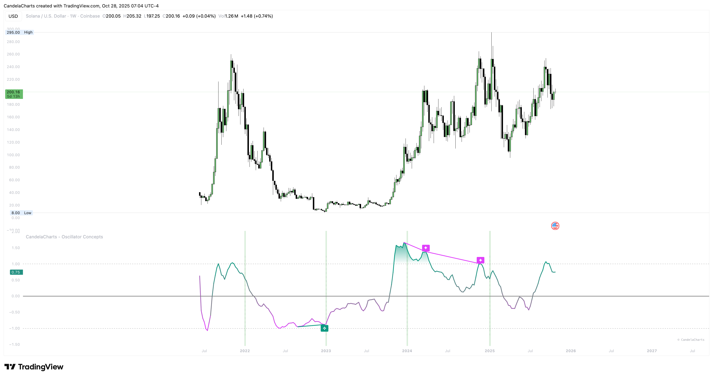

# Divergences

<figure><figcaption></figcaption></figure>

A divergence is a polite refusal. Price prints a new extreme, but The Line doesn’t back it up. That can hint at exhaustion, absorption, or stealth accumulation/distribution.

### **Quality over quantity**

A stricter mode focuses on divergences built at meaningful distance from the band and filters casual mid‑range wiggles. The goal is fewer but clearer opportunities.

### **How to act**

* **Build a case:** divergence + fading participation + softening stripe.
* **Time it:** use a **re‑entry** toward the band, a failure test at structure, or a simple “stop‑going” bar for trigger.
* **Risk:** place invalidation beyond the extreme that formed the divergence and scale out into nearby structure.

### **Expectations**

Not every divergence leads to a full reversal. Many simply resolve into a pause or a two‑leg pullback. Trade the _first turn_, then reassess.

### **Visibility**

Marks and traces are compact—easy to review, unobtrusive live. If you want a clean pane, show only confirmed marks.
