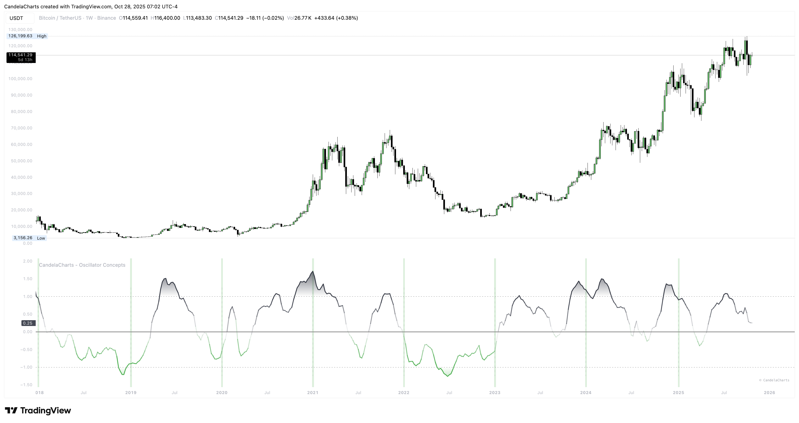

# Fractal Map

<figure><figcaption></figcaption></figure>

Sessions, weeks, and months create natural chapters. The Fractal Map draws light dividers at those boundaries so you always know where you are in the story and can plan around opens, closes, and transitions.

The tool picks sensible dividers for your chart’s timeframe so you don’t have to babysit settings. On higher timeframes it scales to larger segments to keep things clean.

* Treat fresh segments like a reset; they often bring new posture.
* Combine with the stripe: a new week that _starts_ with a stripe flip often behaves differently from the prior week.
* During review, scan where divergences and re‑entries cluster relative to dividers—this reveals patterns in your market.

Keep the lines subtle for live trading. When studying history, temporarily increase contrast, then dial it back.
