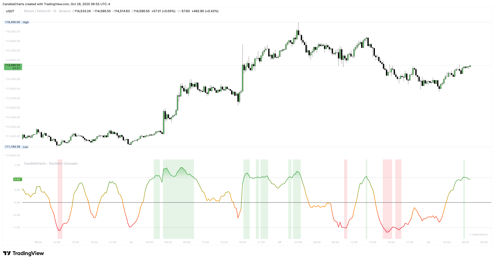

# Overbought & Oversold

<figure><figcaption></figcaption></figure>

Most of the time, The Line lives near the center. That’s normal market rhythm. Inside the band, look to context layers for bias rather than treating the line alone as a signal generator.

When The Line spends time beyond the band, the tape is heated. Gradients make intensity visible without numbers, and the pane tint (optional) reminds you to respect risk.
