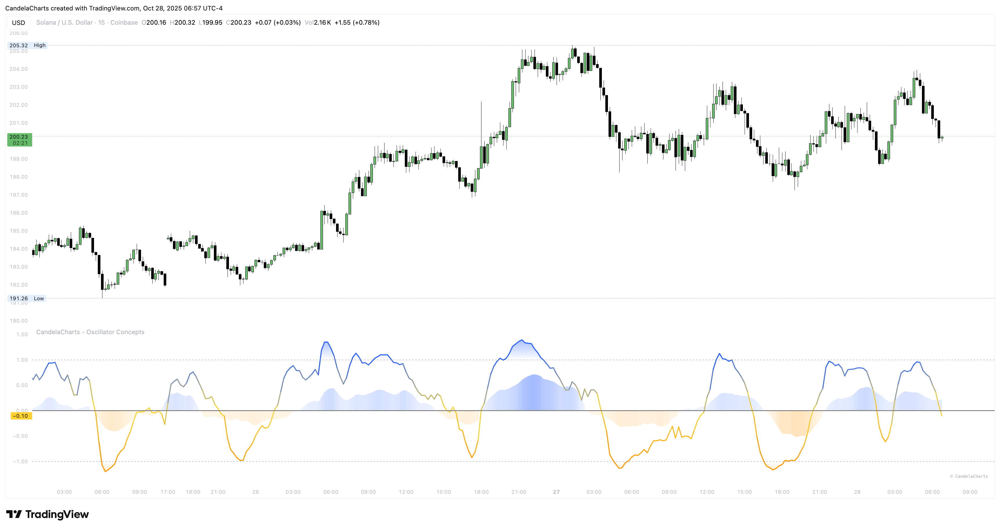

# Participation Analysis

<figure><figcaption></figcaption></figure>

Participation shading reflects commitment. Green bias = buyers doing the work. Red bias = sellers in charge. It’s about _effort_, not just direction.

You can focus on one source of activity at a time—money flow behavior, directional volume, or change in volume—or let the tool balance several and surface agreement automatically. The combined view highlights alignment and softens disagreement so you don’t overreact to one noisy input.

### **How to read it**

* Rising line + clear green → constructive; continuation setups usually behave.
* Rising line + fading/ red → cautious; watch for stall, especially at structure or near the outer zone.
* Falling line + firm red → pressure; avoid counter‑trend longs unless the layer eases.
* Sudden color changes near calendar boundaries often precede behavior shifts—make note.

### **Practical use**

When you plan a breakout trade, glance at participation first. If it’s limp or fighting your idea, wait. When you plan a fade, _prefer_ to see participation tiring into the stretch.
