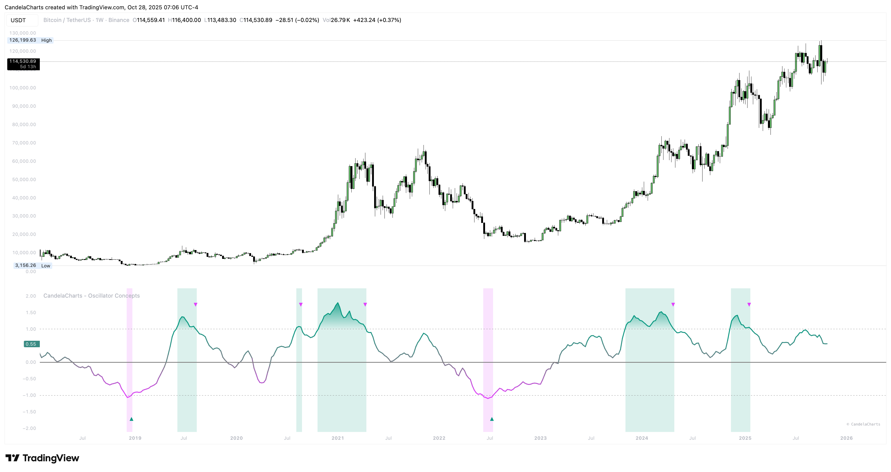
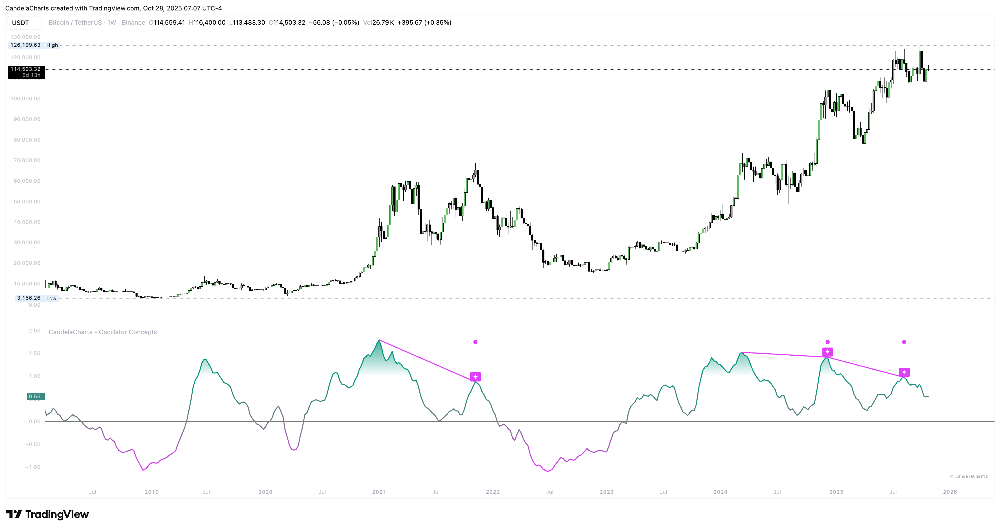

# Signals

This section standardizes the nudges you act on.

### **Two families**

* **Re‑entry markers:** Triangles when The Line returns from outside back toward the band—useful for fades and for trend pullback timing.

<figure><figcaption></figcaption></figure>

* **Divergence markers:** Diamonds for bullish, circles for bearish—visual anchors for your reversal plan.

<figure><figcaption></figcaption></figure>

### **How to prioritize**

* On **trend days**, prioritize signals that agree with the stripe and are not fighting a fresh Pulse.
* On **range days**, re‑entries matter more; take profits at the other side of the range or at obvious structure.
* After a **Pulse**, expect overshoots and messy retests—be patient before fading.

### **Display control**

Show all, only re‑entries, or only divergences. Keep charts clear and focused on your session objective.
