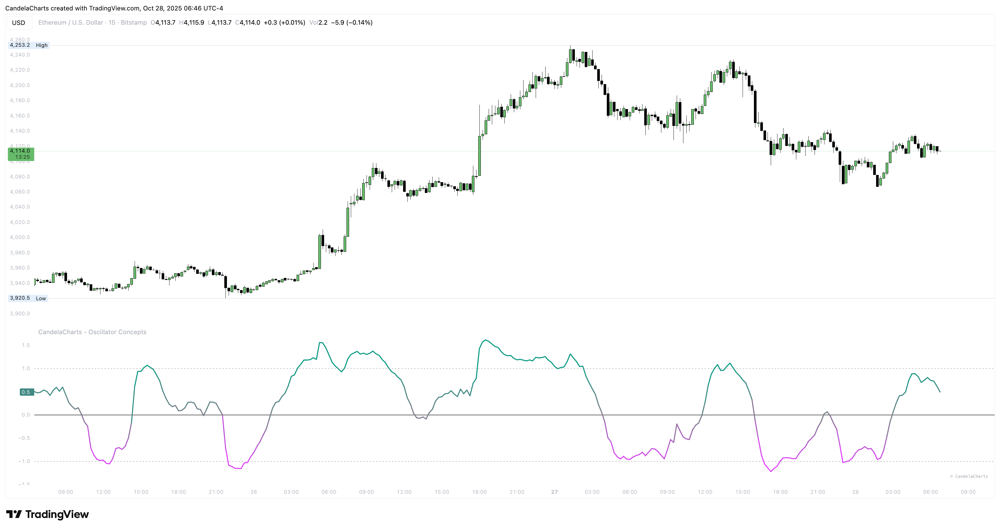

# The Line

<figure><figcaption></figcaption></figure>

You’re looking at one clear line—**The Line**—that blends a handful of familiar momentum reads into a simple, readable curve. Think of the middle as _home base_. When it wanders far outside, the market is running hot. The quiet background layers (Participation, Trend Radar, Velocity Pulse, Fractal Map) are there to add flavor only when you need them—helpful context, not clutter.

Most days you’ll do three simple things:

* When the line sits near home base, take a breath and prepare. Let price build a story and glance at the layers for hints.
* When it pushes well outside, decide whether you’re **fading a stretch** or **riding pressure with the trend**. Make that call because the context agrees, not on a hunch.
* When it comes back toward the band after being stretched, treat that as a practical **timing cue**—especially if participation is tiring and the trend stripe is softening.

If anything ever feels too loud, hide that layer and keep trading. The indicator should feel like a friendly narrator: it highlights pressure, energy, and backdrop so you can handle entries, exits, and risk with a clear head.
