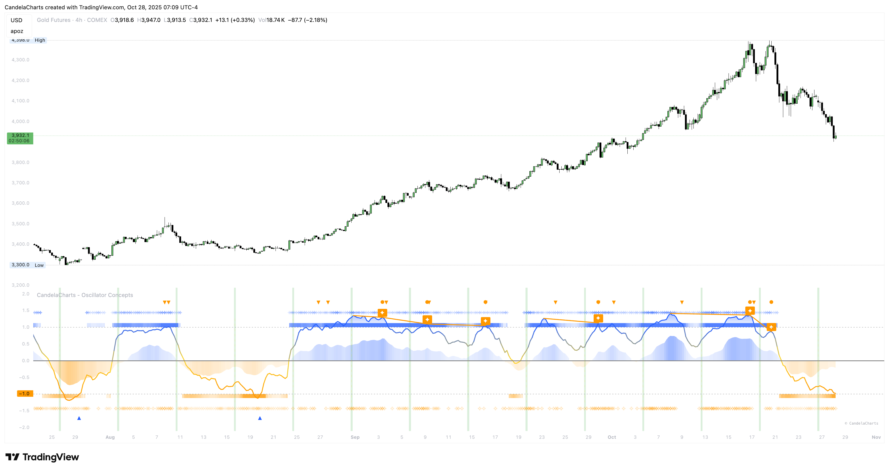
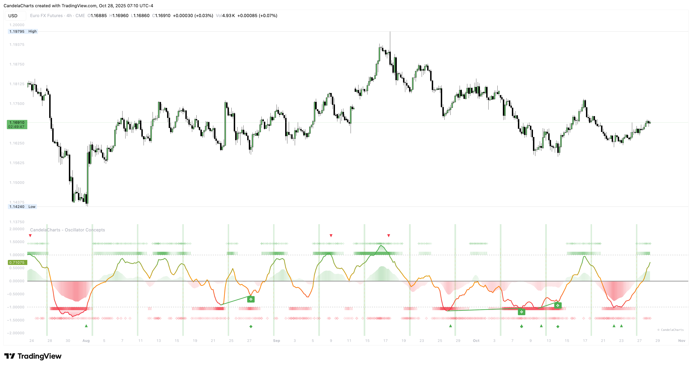
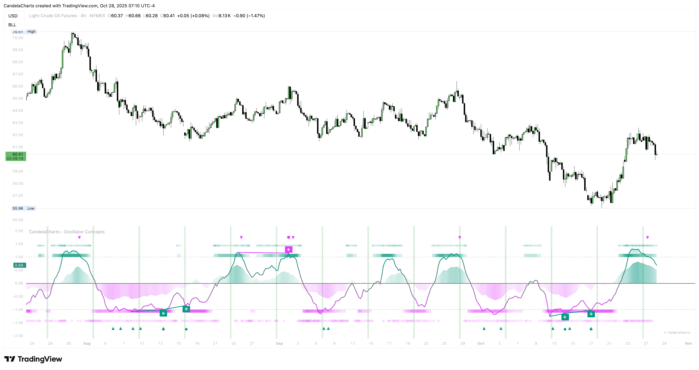
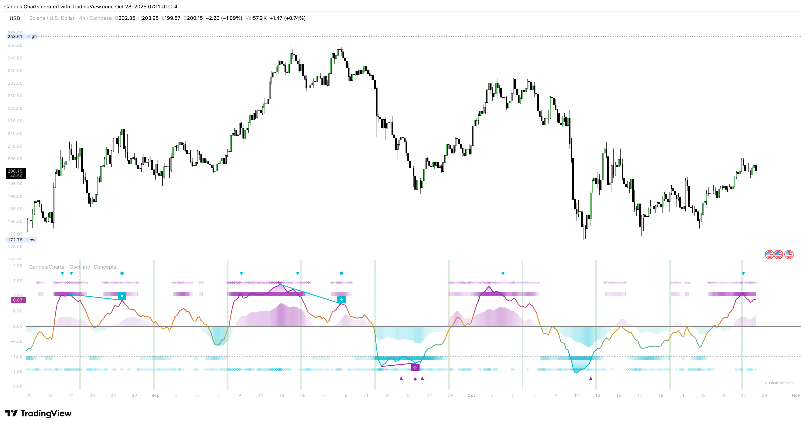
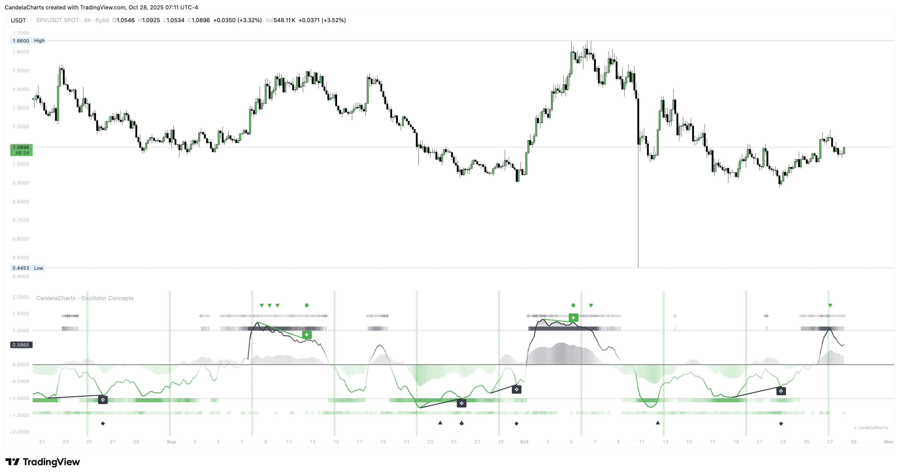
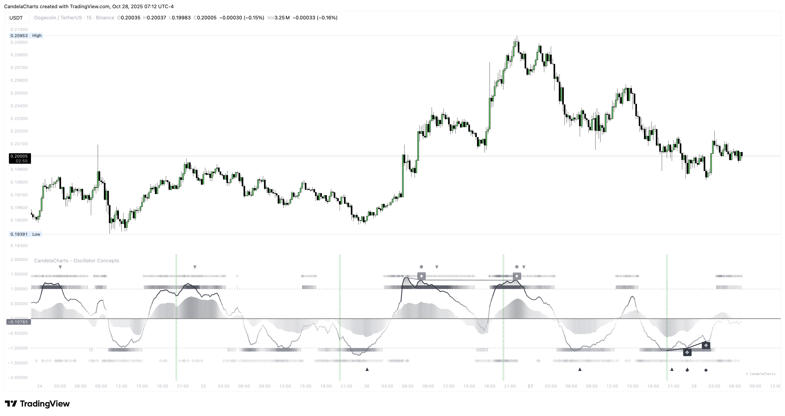
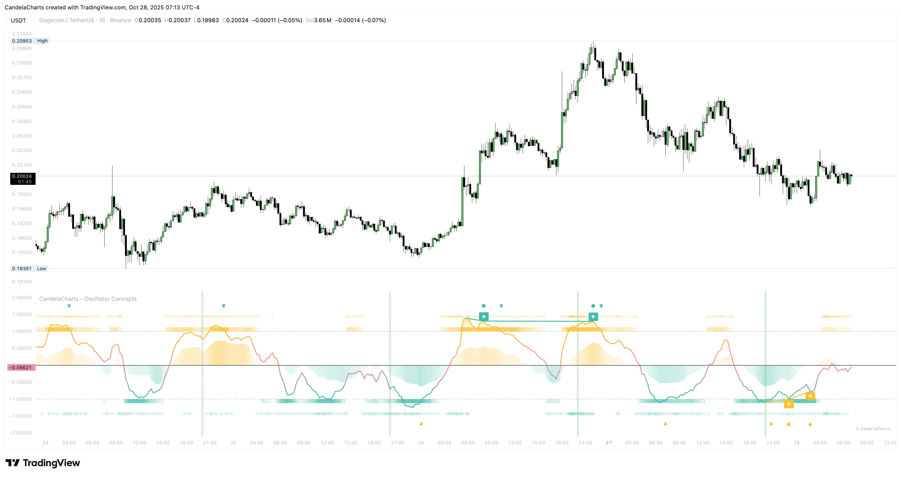

# Themes

### **Built‑in palettes**

Carefully chosen color sets work on light and dark charts and keep meaning consistent across modules. They aim for clarity and legibility rather than flash.

#### Blue - Orange

<figure><figcaption></figcaption></figure>

#### Green - Red

<figure><figcaption></figcaption></figure>

#### Teal - Fuchsia

<figure><figcaption></figcaption></figure>

#### Aqua - Purple

<figure><figcaption></figcaption></figure>

#### Black - Green

<figure><figcaption></figcaption></figure>

#### Black - White

<figure><figcaption></figcaption></figure>

### **Custom look**

Bring your brand colors. Give the tool three base tones—bear, neutral, bull—and it carries them through gradients, stripes, fills, and labels. Your charts look like _your_ charts.

<figure><figcaption></figcaption></figure>

### **Consistency**

Green always signals building/constructive pressure. Red always signals pressing/defensive pressure. Keeping those meanings stable reduces mental load.
