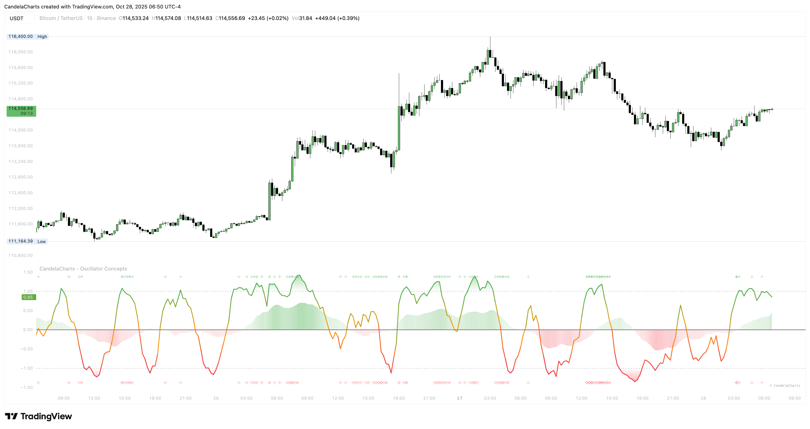
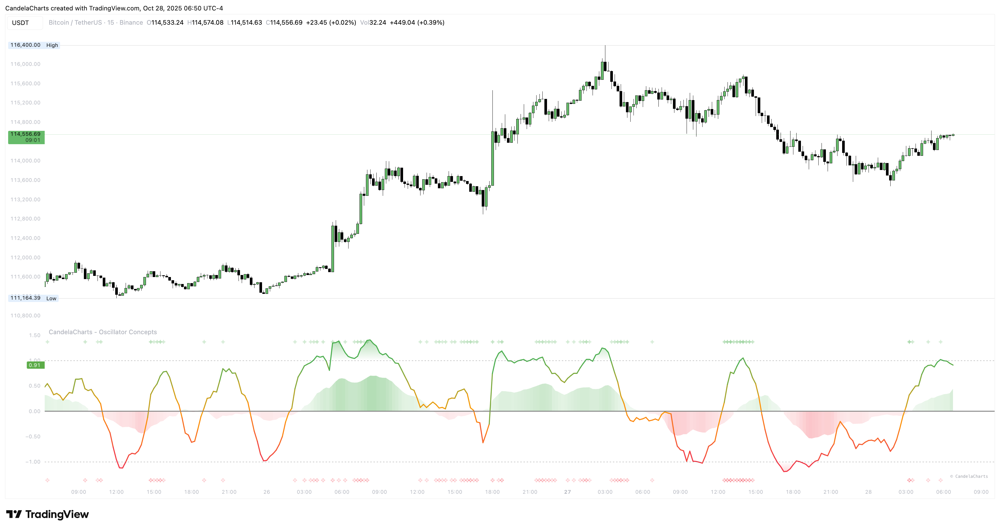
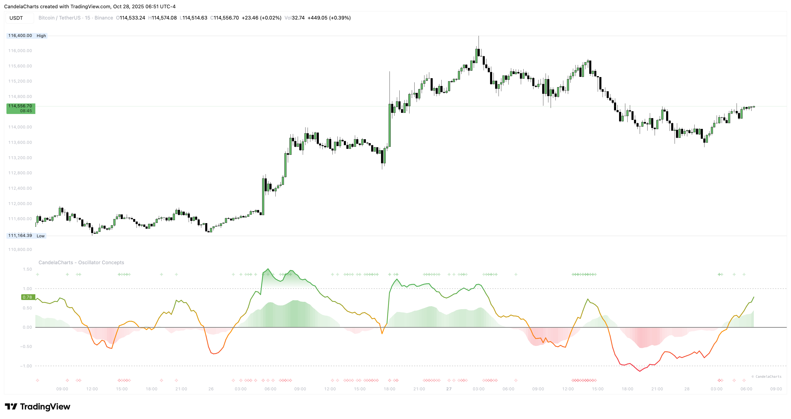
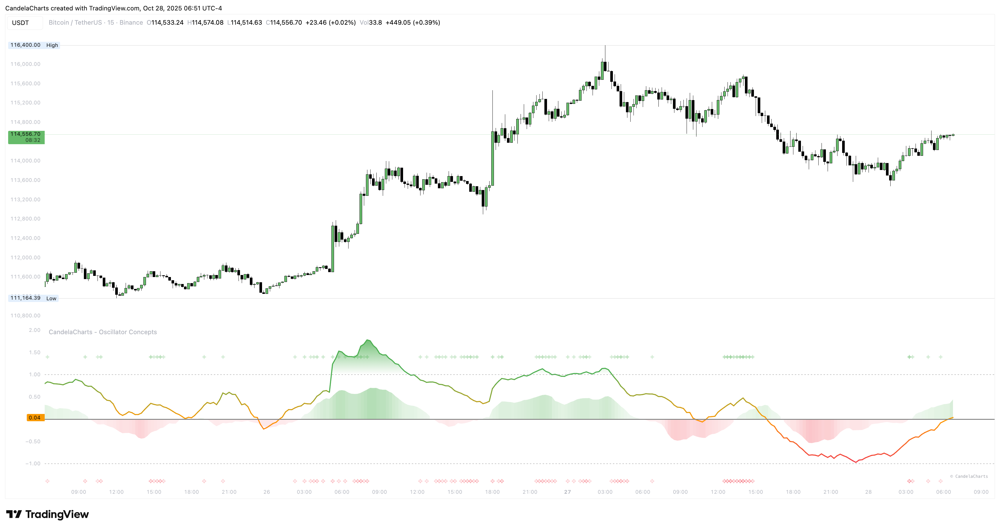

# Trading Profiles

A five‑minute scalp and a weekly swing do not need the same sensitivity. Profiles set the pace so the line “breathes” with your plan and the chart you’re on.

### **Four choices**

* **Scalping:** Quick and lively. Spots small pushes and quick flips. Great for fast screens, micro‑pullbacks, and active management.

<figure><figcaption></figcaption></figure>

* **Day Trade:** Balanced. Filters random noise while keeping up with intraday structure like opening drives, mid‑day rotations, and late pushes.

<figure><figcaption></figcaption></figure>

* **Swing:** Calm. Emphasizes multi‑session moves, higher‑timeframe pullbacks, and base‑building. Small wiggles are intentionally de‑emphasized.

<figure><figcaption></figcaption></figure>

* **Investment:** Unhurried. Focused on bigger cycles, regime changes, and longer consolidations. Best for weekly and monthly planning.

<figure><figcaption></figcaption></figure>

### **How to choose**

Start with the profile that matches your holding period. Trade it for a few sessions without tinkering. If turns feel late, go one step faster. If you feel rushed or whipsawed, go one step calmer. Keep tweaks small—you’re calibrating _feel_, not hunting a magic setting.
