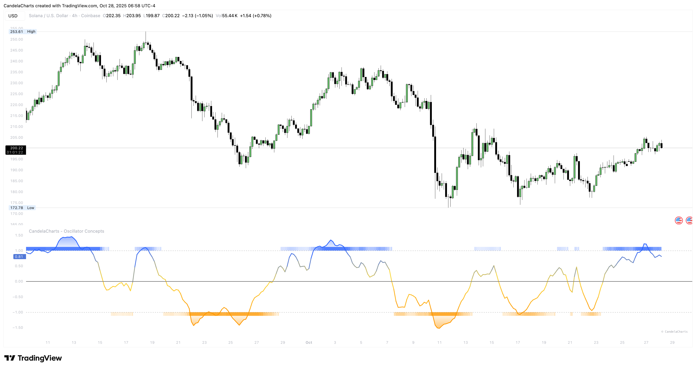

# Trend Radar

<figure><figcaption></figcaption></figure>

The stripe is your weather report. It sits just beyond the band and darkens as the market leans one way. It’s deliberately minimal so it informs without shouting or crowding the pane.

### **Read it like this**

* **Green stripe that sticks:** Favor with‑trend setups—breakouts, pullbacks that hold, and continuation flags. Demanding extra proof before fading keeps you out of trouble.
* **Red stripe that sticks:** Favor shorts or strict criteria for longs—supply retests, lower‑high failures, and breakdown follow‑through.
* **Stripe fading or flipping:** Conviction is weakening. Trade lighter, shorten holds, and be flexible with targets.

### **Edge cases**

&#x20;A stripe can briefly flicker around neutral during lunch hours or low‑energy segments; that doesn’t cancel a larger backdrop. Look for persistence, not single flips.
