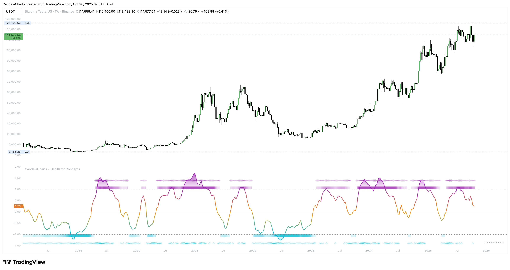

# Velocity Pulse

<figure><figcaption></figcaption></figure>

✦/❖ markers show up only when volatility wakes up. In quiet markets they stay hidden. In charged markets they appear near the stripes so you immediately connect _trend_ with _energy_.

### **Why you care**

* Trend signals with a Pulse often travel farther—but risks and drawdowns expand. Use appropriate size and room.
* Fade attempts during a Pulse demand better location (edges, timing triggers) or smaller size. Think partials and faster accountability.

### **Workflow**

* Outer‑zone push + active stripe + Pulse → caution on early fades; look for pullbacks in the direction of pressure.
* Re‑entry + fading stripe + no Pulse → more forgiving for mean‑reversion; tighten targets at structure.

### **Quiet regimes**&#x20;

When Pulse is absent for long stretches, expect range behavior. In that environment, re‑entries and participation flips carry more weight.
