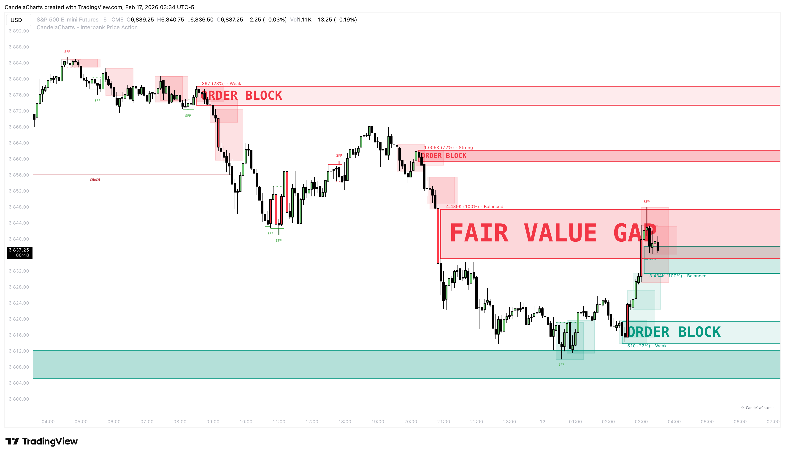

# Interbank Price Action™ 🔜

**Interbank Price Action™** is a professional-grade toolkit designed for traders who demand precision and clarity.

<figure><figcaption></figcaption></figure>

In the chaotic world of financial markets, understanding _why_ price moves is just as important as knowing _where_ it is going. This indicator strips away the noise and reveals the underlying mechanics of the market—Market Structure, Institutional Order Flow, and Liquidity.

Whether you are a seasoned Smart Money Concepts (SMC) trader or just beginning to explore price action, Interbank Price Action™ consolidates tools that would normally require 5 or 6 separate indicators into one seamless, optimized package.
