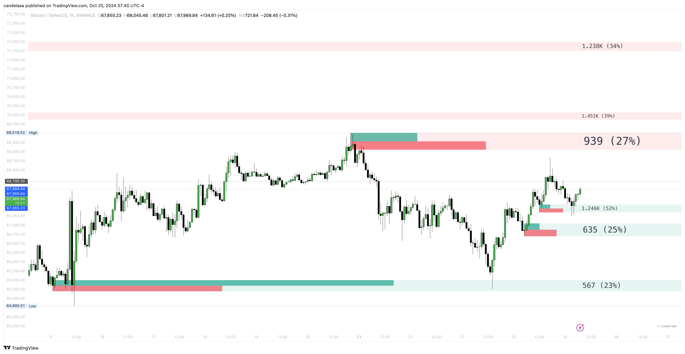

# Blocks

Block Concepts is a group of ICT Blocks that allows you to identify price zones where informed market participants accumulate orders, often serving as potential support or resistance levels.

The toolkit automatically highlights these areas, and they disappear once they are mitigated.

<figure><figcaption></figcaption></figure>

### Settings

<table><thead><tr><th>Name</th><th width="249">Default</th><th>Options<select multiple><option value="mEFT0f0UKPXF" label="Order Blocks" color="blue"></option><option value="UZS6rLmO5b1i" label="Breaker Blocks" color="blue"></option><option value="eN5zUBWmPU0F" label="Swing Order Blocks" color="blue"></option><option value="iAbKwOtaBGSU" label="Mitigation Blocks" color="blue"></option><option value="GtnR6R3fWvvc" label="Rejection Blocks" color="blue"></option><option value="6UkyBJFdAjhw" label="Propulsion Blocks" color="blue"></option><option value="QbboJ1dmgkiv" label="Vacuum Blocks" color="blue"></option><option value="lWBBABqc5gnw" label="Volume" color="blue"></option><option value="mcNpKttVcMEO" label="Pivot Points" color="blue"></option><option value="YzUiroSR7tOG" label="Previous" color="blue"></option><option value="Bba8vYrb7FPw" label="Recent" color="blue"></option><option value="2B7gVpKuMnUs" label="None" color="blue"></option><option value="wlhsjI9Bxj8f" label="BOS" color="blue"></option><option value="hiTfEvb12zCH" label="CHoCH" color="blue"></option><option value="rh4Gi7253aES" label="Absolute" color="blue"></option><option value="XjIFvJ9bNStV" label="Middle" color="blue"></option><option value="80S2zLrZMTvv" label="Full" color="blue"></option><option value="14CEnwzgrD9C" label="Accurate" color="blue"></option><option value="JatpLHi2IGTK" label="Precise" color="blue"></option><option value="R0QXvma8NzK9" label="Solid" color="blue"></option><option value="GKtD4llMd5Go" label="Dotted" color="blue"></option><option value="dpEcNQ4GIx44" label="Dashed" color="blue"></option><option value="AhNHzR7qOTOD" label="Wick" color="blue"></option><option value="64GWnrsSN3MK" label="Average" color="blue"></option></select></th></tr></thead><tbody><tr><td>Show</td><td>Order Blocks</td><td>Order Blocks, Breaker Blocks, Swing Order Blocks</td></tr><tr><td>Last</td><td>5</td><td></td></tr><tr><td>Filtering</td><td>None</td><td>None, BOS, CHoCH</td></tr><tr><td>Mitigation</td><td>None</td><td>Wick, Average</td></tr><tr><td>Positioning</td><td>Accurate</td><td>Full, Middle, Accurate, Precise</td></tr><tr><td>Timeframe</td><td>Chart</td><td></td></tr><tr><td>Show mid-line</td><td>Dotted</td><td>Solid, Dotted, Dashed</td></tr><tr><td>Show border</td><td></td><td>Solid, Dotted, Dashed</td></tr><tr><td>Buy/Sell activity</td><td>true</td><td></td></tr><tr><td>Show volume</td><td>false</td><td></td></tr><tr><td>Show metrics</td><td>true</td><td></td></tr><tr><td>Hide overlap</td><td>Previous</td><td></td></tr><tr><td>Grayscale</td><td>false</td><td></td></tr></tbody></table>

The Price Action Toolkit™ includes the following types of blocks, each representing different areas of potential support or resistance:

* Order Blocks
* Swing Order Blocks
* Breaker Blocks

Each of these block types is automatically detected and highlighted by the toolkit, allowing traders to quickly identify critical areas on the chart.

### Order Blocks

Order Blocks are categorized into two types: Bullish Order Blocks and Bearish Order Blocks. Bullish Order Blocks typically form near swing lows and are considered potential support zones.

Conversely, Bearish Order Blocks usually appear near swing highs and are regarded as potential resistance areas.

<figure><figcaption></figcaption></figure>

To display longer-term Order Blocks, users can adjust the Length setting in the Order Blocks section. This setting determines the lookback period used for detecting swing points, which in turn constructs the Order Blocks.


The toolkit showcases internal activity and metrics based on volume data.


### Swing Order Blocks

A swing order block represents a key area on a price chart where significant order accumulation is believed to have occurred.

<figure><figcaption></figcaption></figure>

These zones are critical for traders, as they suggest areas where major market participants have placed large buy or sell orders.

The accumulation of these orders can exert considerable influence on future price movements, making swing order blocks valuable for identifying potential support or resistance levels.

Traders often base their decisions on these areas, anticipating that the presence of concentrated orders will impact the direction and strength of price trends.

### Breaker Blocks

A breaker block occurs when an order block fails, resulting in a significant shift in market structure.

This concept marks a critical juncture where the price reverses its previous trend direction, often indicating the potential for a new trend to emerge.

<figure><figcaption></figcaption></figure>

For traders, breaker blocks represent key moments of transition in the market, offering strategic entry points for trades based on the expected continuation of the new trend.

By identifying breaker blocks, traders can capitalize on these shifts, positioning themselves to take advantage of the market's evolving dynamics.

### Metrics

Metrics are displayed next to a block, positioned near the most recent historical price bar. These metrics reflect the accumulated volume within the interval used to create the block.

The volume information helps assess the significance of each block, with larger volumes indicating a more substantial block.

Additionally, the percentage shown indicates the proportion of the order block's volume relative to the total accumulated volume of all Volumetric Blocks on the chart.

This percentage provides a quick way to identify which Volumetric Blocks are more noteworthy and potentially more influential in the market.
