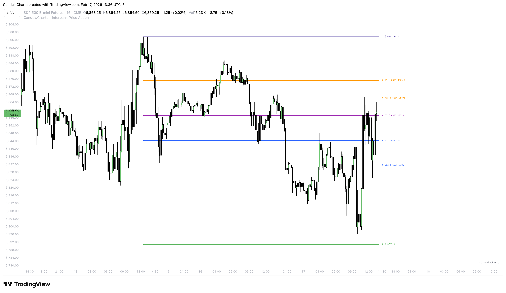
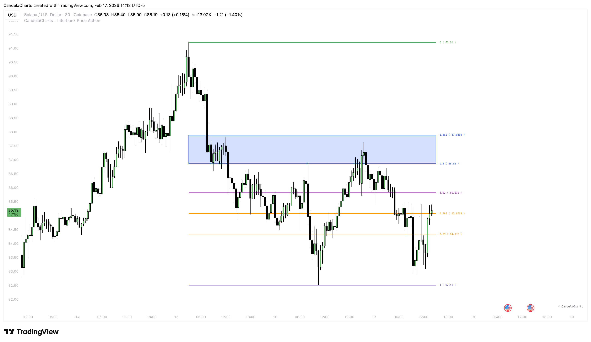

# Fibonacci Retracement

### Precise Market Geometry 

The **Fibonacci Retracement** tool is essential for identifying potential reversal zones during a trend. Instead of drawing lines manually every time the market moves, this indicator automatically identifies the most relevant recent swing and plots key retracement levels for you.

<figure><figcaption></figcaption></figure>

This feature is designed to help you spot "discounted" entry prices in an uptrend or "expensive" entry prices in a downtrend.

### Key Levels Explained 

We automatically plot the most critical Fibonacci ratios used by institutional traders:

* **0 (0%)**: The start of the retracement (Swing High/Low).
* **0.382 (38.2%)**: **Shallow Retracement**.
  * _Usage_: Strong potential trend continuation. If price bounces here, the momentum is very high.
* **0.5 (50%)**: **Equilibrium**.
  * _Usage_: The midpoint of the swing. Often acts as a psychological support/resistance level.
* **0.618 (61.8%)**: **The Golden Pocket**.
  * _Usage_: The most famous reversal ratio. A highly probable area for price to turn.
* **0.705 (70.5%)**: **OTE (Optimal Trade Entry)**.
  * _Usage_: A precision level often used by algorithmic traders for deep retracement entries.
* **0.79 (79%)**: **Deep Retracement**.
  * _Usage_: The "last line of defense" before a full reversal. Entries here offer excellent Risk/Reward ratios.
* **1 (100%)**: The invalidation point (Swing High/Low).

### Zones of Interest 

To simplify your chart, we verify two distinct zones based on depth:

#### 1. Shallow Pullback Zone 

<figure><figcaption></figcaption></figure>

* **Range**: **0.382 – 0.50**
* **Meaning**: This zone represents a minor correction in a strong trend. Aggressive traders look for entries here to catch continuation moves quickly.

#### 2. Deep Retracement Zone 

<figure><figcaption></figcaption></figure>

* **Range**: **0.705 – 0.79**
* **Meaning**: This is the "sweet spot" for high R:R trades. Price has pulled back significantly, offering a cheap entry before the trend (ideally) resumes. This area is often referred to as the "Kill Zone" or "OTE".
