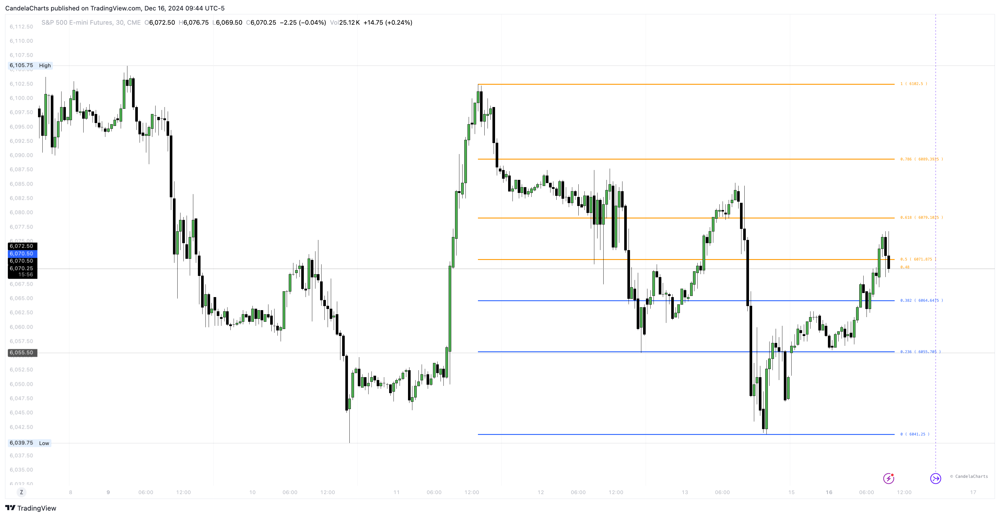

# Fib Retracement

Fibonacci retracements are levels derived from two price points using ratios from the Fibonacci sequence.

<figure><figcaption></figcaption></figure>

The toolkit allows users to display Fibonacci retracements, based on a range between one upper and one lower price extremity.

### Settings

<table><thead><tr><th>Name</th><th>Defaut</th><th>Options<select multiple><option value="4zBx0SdDBXNM" label="Days" color="blue"></option><option value="NraB3MBxf03z" label="Candles" color="blue"></option><option value="eYXqcSNepj0n" label="Dotted" color="blue"></option><option value="Pr7dhC3V187x" label="Dashed" color="blue"></option><option value="PhtCB63IYa7c" label="Solid" color="blue"></option></select></th></tr></thead><tbody><tr><td>Show </td><td>false</td><td></td></tr><tr><td>Loopback</td><td>5</td><td></td></tr><tr><td>Line style</td><td></td><td>Dotted, Dashed, Solid</td></tr><tr><td>Current level</td><td>false</td><td></td></tr><tr><td>Show 0.886/1.113</td><td>false</td><td></td></tr><tr><td>Use dynamic coloring</td><td>true</td><td></td></tr><tr><td>Show labels</td><td>true</td><td></td></tr><tr><td>Reverse</td><td>false</td><td></td></tr><tr><td>Extend</td><td>false</td><td></td></tr></tbody></table>

Users can customize the length of the lookback period, choosing between specifying it in terms of days or the number of candles.&#x20;

This flexibility allows for precise adjustments to fit different trading strategies and timeframes, ensuring that the analysis aligns with individual trading needs and preferences.
