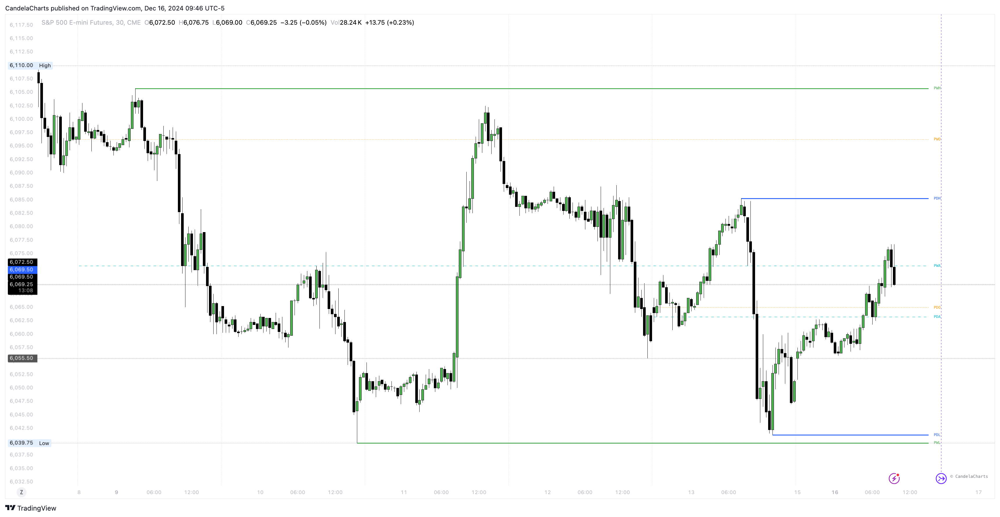

# Key Levels

Traders often use the highest and lowest price values from previous days, weeks, months, or specific periods as support and resistance levels.

<figure><figcaption></figcaption></figure>

The toolkit can provide these levels based on:

* The previous day
* The previous week
* The previous month
* Quarterly periods
* Yearly periods

### Settings

<table><thead><tr><th>Name</th><th>Default</th><th>Options<select multiple><option value="6VvdyiUL7H1x" label="Solid" color="blue"></option><option value="qHpE4LG8FW5k" label="Dotted" color="blue"></option><option value="smESmabKUdEr" label="Dashed" color="blue"></option></select></th></tr></thead><tbody><tr><td>Day</td><td>false</td><td>Solid, Dotted, Dashed</td></tr><tr><td>Week</td><td>false</td><td>Solid, Dotted, Dashed</td></tr><tr><td>Month</td><td>false</td><td>Solid, Dotted, Dashed</td></tr><tr><td>Quarter</td><td>false</td><td>Solid, Dotted, Dashed</td></tr><tr><td>Year</td><td>false</td><td>Solid, Dotted, Dashed</td></tr><tr><td>Show Average</td><td>false</td><td>Solid, Dotted, Dashed</td></tr><tr><td>Show Open</td><td>false</td><td>Solid, Dotted, Dashed</td></tr></tbody></table>

Each of these levels can be displayed using the HIGHS & LOWS MTF settings section.
