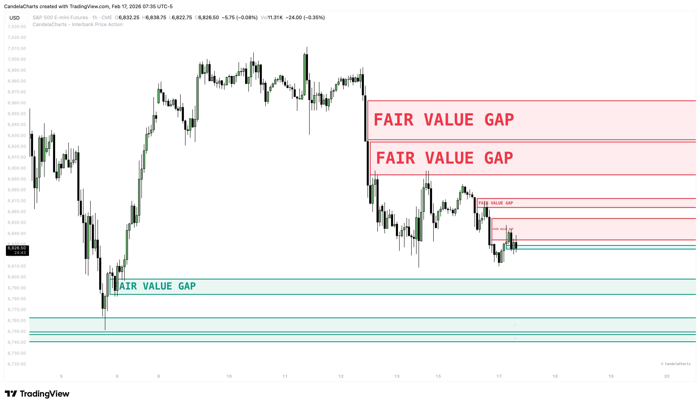
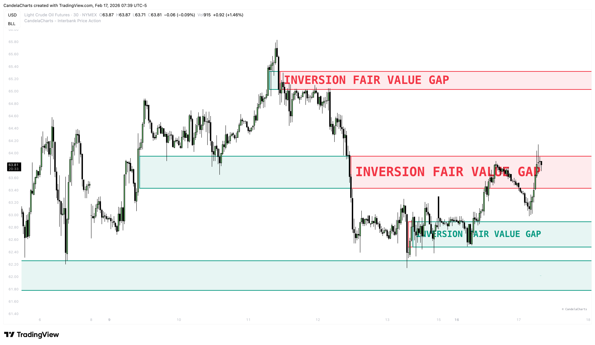
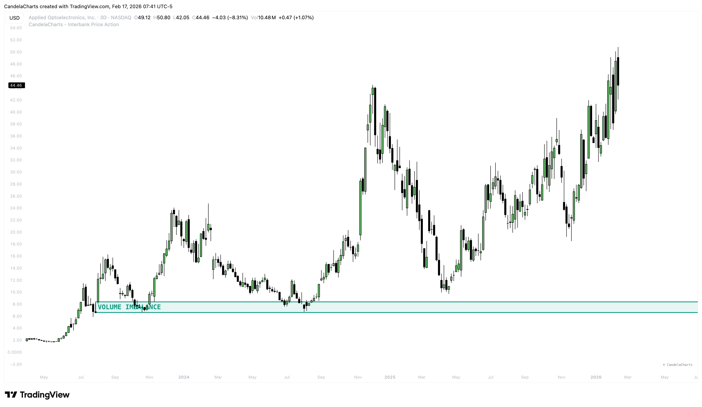
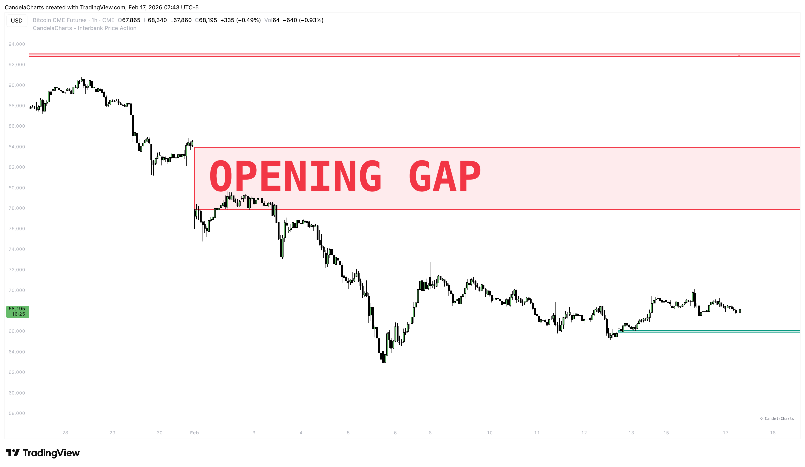
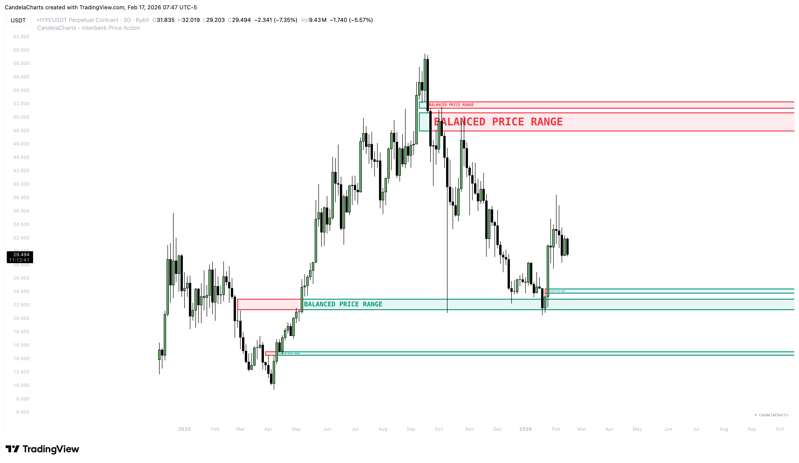
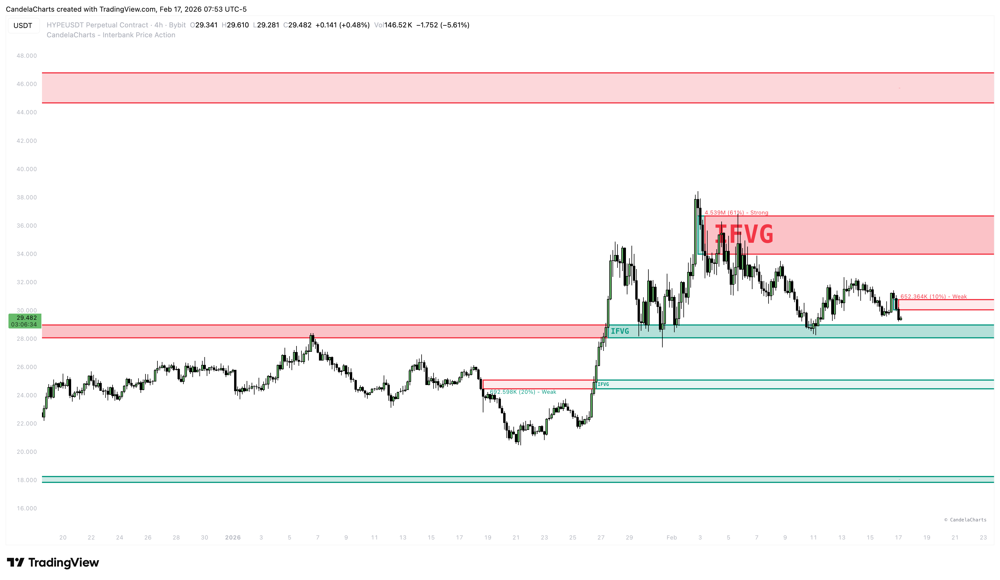
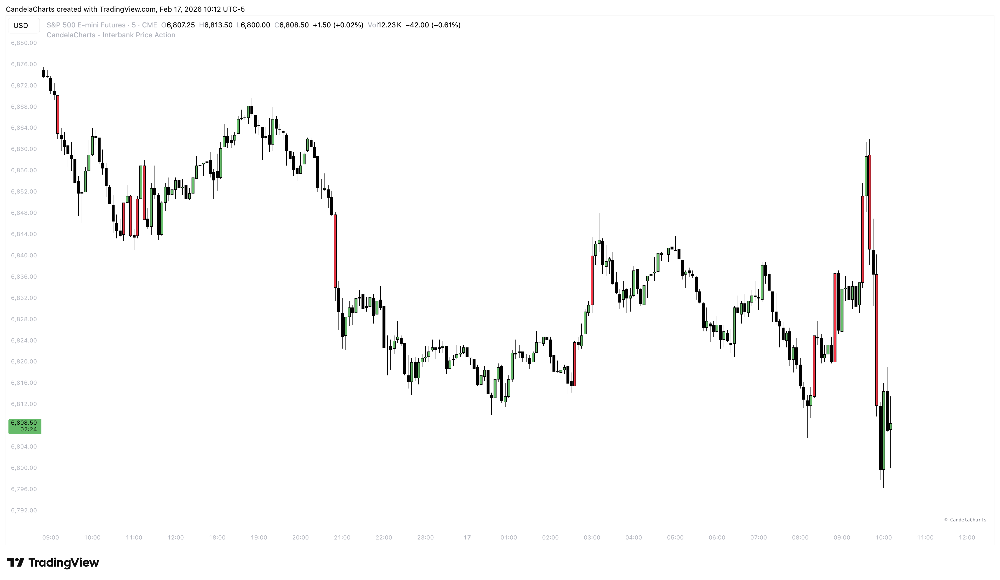

# Imbalances

### Market Inefficiencies 

**Imbalances**—most commonly known as **Fair Value Gaps (FVG)**—occur when buying or selling pressure is so intense that price "skips" levels, leaving behind unfilled orders.

These gaps act as:

1. **Magnets**: Price often returns to "fill" or "rebalance" the gap.
2. **Support/Resistance**: Once filled, the zone often triggers a reversal.

### Gap Types Explained 

#### 1. Fair Value Gap (FVG) 

<figure><figcaption></figcaption></figure>

The most fundamental imbalance pattern.

* **Structure**: A 3-candle sequence where the wicks of candle 1 and candle 3 do not overlap. The space between them is the gap.
* **Usage**: Wait for price to tap into the FVG (often the 50% level) for a high-probability entry.

#### 2. Inversion FVG (IFVG) 

<figure><figcaption></figcaption></figure>

An FVG that has "flipped" its polarity.

* **Scenario**: Price smashes through a Bullish FVG without stopping.
* **Result**: That failed Support zone now becomes **Resistance**. We automatically label this as a **Bearish Inversion FVG**.
* **Power**: These are exceptionally strong signals for trend reversals or continuations.

#### 3. Volume Imbalance (VI) 

<figure><figcaption></figcaption></figure>

A gap formed by the difference between the **Close** of one candle and the **Open** of the next.

* **Context**: Often seen in low-liquidity environments or during high-volatility news events.

#### 4. Opening Gap (OG) 

<figure><figcaption></figcaption></figure>

The jump between yesterday's market **Close** and today's market **Open**.

* **Context**: Critical for Daily bias. If price opens huge gap up, the OG often acts as support for the day.

#### 5. Balanced Price Range (BPR) 

<figure><figcaption></figcaption></figure>

A complex pattern where a Bullish FVG and a Bearish FVG overlap.

* **Meaning**: The market has aggressively bought up and then sold down through the same price area. It represents a "knot" of equilibrium that price respects highly.

### Volume & Strength 

<figure><figcaption></figcaption></figure>

Not all imbalances are powerful. We use volume analysis to grade them for you:

* **💪 Strong**: The imbalance was formed with high relative volume. Probability of holding: **High**.
* **⚖️ Balanced**: The imbalance had average volume. Probability of holding: **Medium**.
* **🥀 Weak**: The imbalance had low volume. Probability of holding: **Low**. Use with caution.

### Displacement

Displacement serves as a critical filter for identifying high-probability setups. It refers to the energetic price movement that often precedes the creation of an imbalance, signaling institutional intent.

<figure><figcaption></figcaption></figure>

**Usage:** Look for the colored bars (Displacement candles) on your chart. When an FVG is formed by one of these candles, it carries significantly more weight than a standard FVG. These are the zones you should prioritize for potential entries.

**Value:**

* **Confirmation**: Validates that "Smart Money" is participating in the move.
* **Filtering**: Helps you avoid false signals in choppy or ranging markets by focusing only on moves with real conviction.
