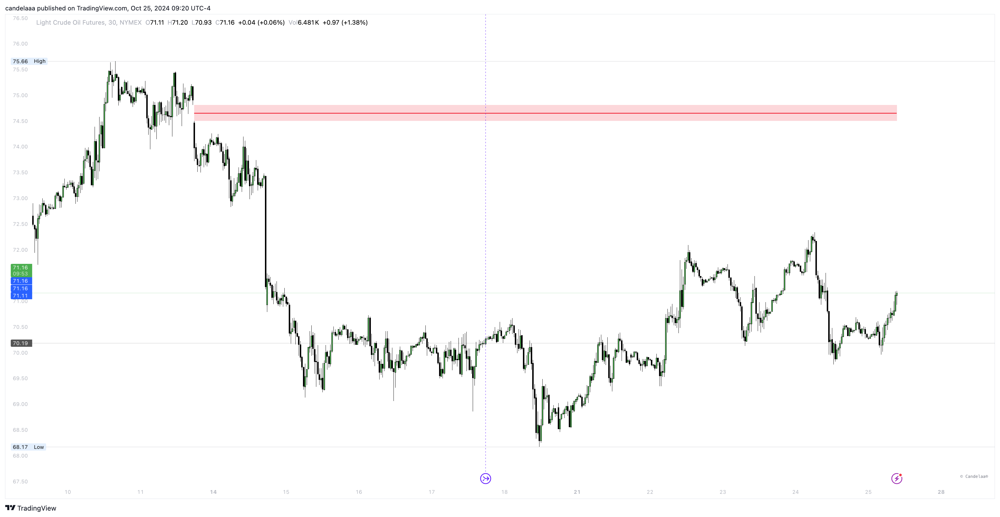

# Imbalances

Imbalance Concepts is an aggregation of ICT Imbalances like FVG, IFVG, BPR, etc. Imbalances in market prices occur when there is a significant discrepancy between supply and demand, causing the asset to deviate from its fair value. This imbalance can create inefficiencies in the market.

<figure><figcaption></figcaption></figure>

Typically, prices will move back toward the area where the imbalance took place in an effort to restore equilibrium. These regions of imbalance often act as support and resistance levels, providing key areas of interest for traders.

### Settings

<table><thead><tr><th>Name</th><th>Default</th><th>Options<select multiple><option value="OxtgHGzJrNlI" label="FVG" color="blue"></option><option value="w7UGWTFczN49" label="IFVG" color="blue"></option><option value="8UhEo0yLsJwD" label="VI" color="blue"></option><option value="uG2F560to2ZM" label="OG" color="blue"></option><option value="kI56bVmk3cgq" label="BPR" color="blue"></option><option value="GiU8Rwn4gCXS" label="RDRB" color="blue"></option><option value="TNHTSnY5M7ET" label="NWOG" color="blue"></option><option value="PdkaafZeEny1" label="NDOG" color="blue"></option><option value="dN2m1ieovCJD" label="Close" color="blue"></option><option value="8C7XLfb75OxT" label="Wick" color="blue"></option><option value="dRXkNoX1t0Pq" label="Dotted" color="blue"></option><option value="REmP9k6UBjVK" label="Solid" color="blue"></option><option value="lgvuhFNIFAaZ" label="Dashed" color="blue"></option><option value="vPFCHQFUw8p8" label="None" color="blue"></option><option value="nzCXIWxtv0FP" label="Open to Close" color="blue"></option><option value="g9YfpeHJwdOp" label="High to Low" color="blue"></option></select></th></tr></thead><tbody><tr><td>Show</td><td>FVG</td><td>FVG, IFVG, VI, OG, BPR</td></tr><tr><td>Show last</td><td>5</td><td></td></tr><tr><td>Length</td><td>10</td><td></td></tr><tr><td>Mitigation</td><td>None</td><td>Close, Wick, None</td></tr><tr><td>Timeframe</td><td>Chart</td><td></td></tr><tr><td>Threshold</td><td>0</td><td></td></tr><tr><td>Show mid-line</td><td>true</td><td>Dotted, Dashed, Solid</td></tr><tr><td>Show border</td><td>false</td><td>Dotted, Dashed, Solid</td></tr><tr><td>Hide overlap</td><td>false</td><td></td></tr><tr><td>Displacement</td><td>Open to Close</td><td>Open to Close, High to Low</td></tr><tr><td>Displacement Length</td><td>60</td><td></td></tr><tr><td>Displacement Strength</td><td>4</td><td></td></tr><tr><td>Extend</td><td>false</td><td></td></tr><tr><td>Elongate</td><td>false</td><td></td></tr></tbody></table>

The toolkit is able to detect the following imbalances:

* Fair Value Gaps (FVG)
* Inversion Fair Value Gaps (IFVG)
* Opening Gaps (OG)
* Volume Imbalances (VI)
* Balanced Price Range (BPR)

### Fair Value Gaps (FVG)

Fair Value Gaps (FVG) are market imbalances identified within a sequence of three candles.

<figure><figcaption></figcaption></figure>

These gaps occur when the wicks of the outer candles do not overlap the body of the central candle, creating a range between the wicks that marks the Fair Value Gap.

A bullish Fair Value Gap forms when the current low is higher than the high two bars prior.

Conversely, a bearish Fair Value Gap occurs when the current high is lower than the low two bars prior.

### Inversion Fair Value Gaps (IFVG)

Inverse Fair Value Gaps (FVGs) are essentially mitigated Fair Value Gaps that can serve as potential retest areas.

<figure><figcaption></figcaption></figure>

When a bullish Fair Value Gap is mitigated, it creates a bearish inverse Fair Value Gap, indicating that the price might retrace upward to retest the area.

Conversely, a mitigated bearish Fair Value Gap results in a bullish inverse Fair Value Gap, suggesting that the price could retrace downward to retest the area.

### Opening Gaps (OG)

Opening Gaps are market imbalances identified by two consecutive candles with non-overlapping wicks, creating a visible gap or empty area.

<figure><figcaption></figcaption></figure>

These imbalances are frequently observed in stocks and in shorter timeframes of cryptocurrencies and forex pairs.

### Volume Imbalances (VI)

Volume Imbalances occur when two consecutive candles have non-overlapping bodies, but their wicks do overlap.

<figure><figcaption></figcaption></figure>

These imbalances are typically observed in stocks or in shorter timeframes of cryptocurrencies and forex pairs.

### Balanced Price Range (BPR)

The Balanced Price Range is a key concept in understanding how price behaves around certain levels that represent equilibrium or "fair value" in the market.

<figure><figcaption></figcaption></figure>

The idea behind BPR is to identify price ranges where both buying and selling pressures are balanced, indicating a period of consolidation or price acceptance.

In practice, it often shows up in areas where market makers have accumulated positions, and the price tends to oscillate around a central or equilibrium level.

### Mitigation

Once the price breaches a highlighted imbalance area, it is considered "mitigated" and will automatically be removed.

The Price Action Toolkit™ indicator allows users to customize the mitigation conditions through the Mitigation setting. Available options include:

* **Average**: For a bullish imbalance, when the closing price is below the midpoint of the price range, it indicates that despite upward momentum, the price closed lower than the average, suggesting a potential buying opportunity. Conversely, for a bearish imbalance, if the closing price is above the midpoint, it means that despite downward pressure, the price closed higher than the average, signaling a potential selling opportunity. Identifying these conditions helps traders recognize significant market imbalances and make more informed decisions.
* **Wick**: When the low price breaches the bottom boundary for a bullish imbalance, it signals that the price has dipped below a key support level. This breach may indicate a potential upward reversal as buyers enter the market at lower prices. Conversely, when the high price breaches the top boundary for a bearish imbalance, it means the price has exceeded a crucial resistance level. This situation could lead to a downward reversal due to increased selling pressure. Identifying these breaches helps traders spot significant market imbalances and make more informed trading decisions.
