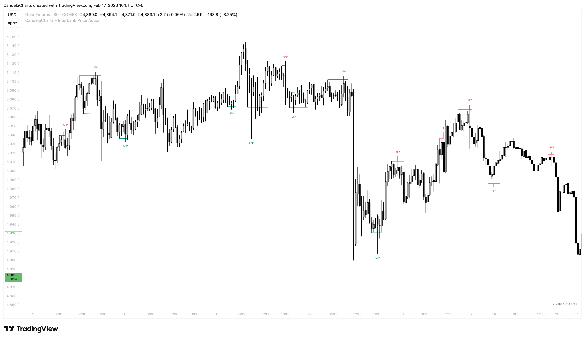

# Swing Failure Pattern

The **Swing Failure Pattern (SFP)** is one of the most reliable reversal setups used by institutional traders. It identifies a "Stop Hunt" or "Liquidity Grab" where large players push price beyond a key level to trigger orders, only to reverse direction immediately.

<figure><figcaption></figcaption></figure>

This pattern tells you: "The breakout was a trap."

### Anatomy of an SFP 

1. **The Target**: Identify a key **Swing High** or **Swing Low**. This is where retail stop-losses and breakout orders are resting.
2. **The Sweep**: Price pushes _beyond_ this swing point, grabbing the liquidity.
3. **The Failure**: Crucially, the candle **fails to close** beyond the level. It leaves a long wick and closes back inside the previous range.

### Types of SFP 

#### Bearish SFP (Short Setup) 

* **Context**: Occurs at a Swing High.
* **Action**: Price sweeps the high, taking out buy-side liquidity (stops of short sellers + breakout buyers).
* **Signal**: The candle closes _below_ the previous swing high.
* **Implication**: Rejection of higher prices. Institutional selling has absorbed the buying pressure.

#### Bullish SFP (Long Setup) 

* **Context**: Occurs at a Swing Low.
* **Action**: Price sweeps the low, taking out sell-side liquidity (stops of long buyers + breakdown sellers).
* **Signal**: The candle closes _above_ the previous swing low.
* **Implication**: Rejection of lower prices. Institutional buying has absorbed the selling pressure.
