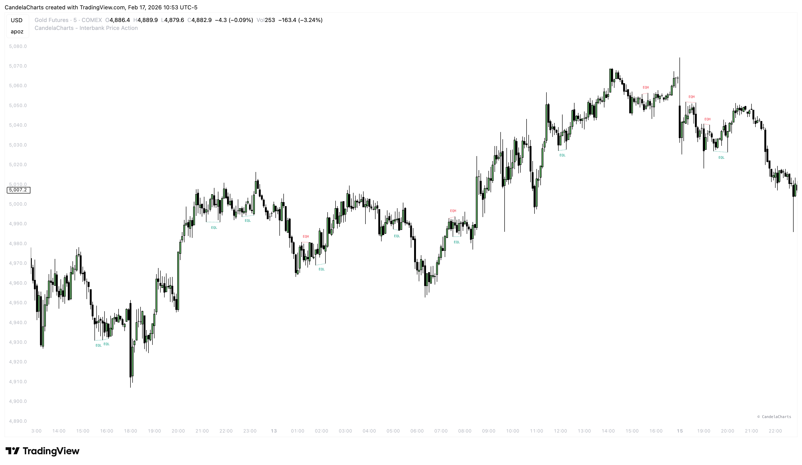
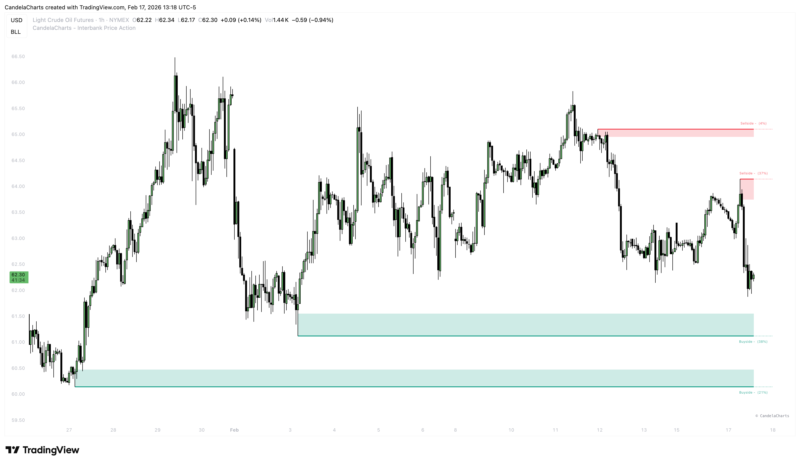
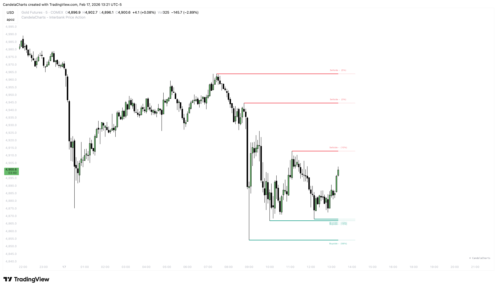
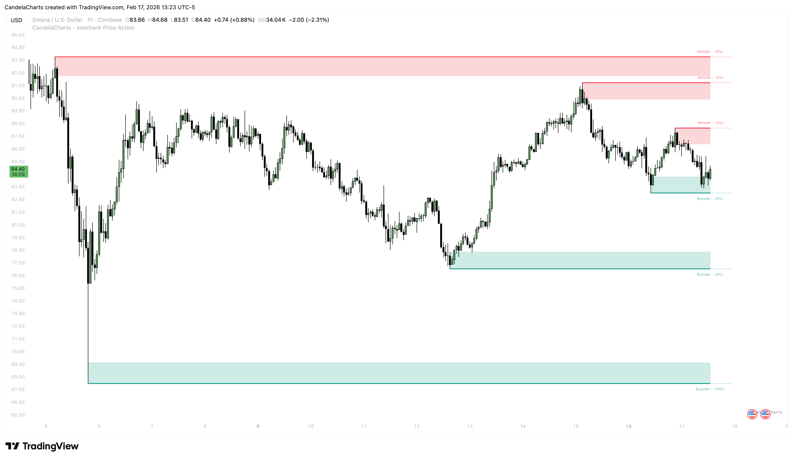
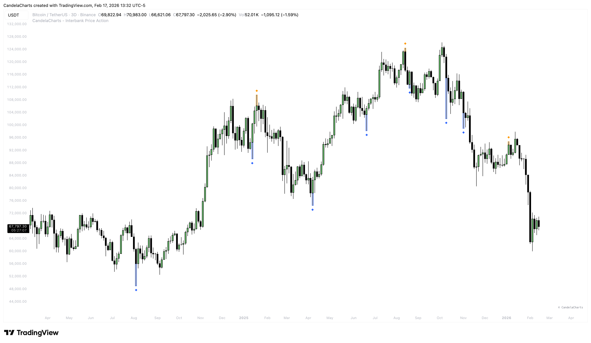

# Liquidity

Liquidity is the fuel of the market. Price constantly seeks areas where orders are resting to facilitate large institutional transactions. Identifying these pools of liquidity helps you anticipate where price is likely to go.

### Equal Highs & Lows (EQH / EQL) 

One of the most common retail patterns is the "Double Top" or "Double Bottom". While retail traders see these as reversal patterns and place their stops just above/below them, institutions see them as liquidity pools to target.

<figure><figcaption></figcaption></figure>

#### How It Works 

We scan for Swing Highs or Lows that are relatively equal in price.

* **EQH (Equal Highs)**: Price forms two or more peaks at the same level. Likely to be swept to the upside.
* **EQL (Equal Lows)**: Price forms two or more troughs at the same level. Likely to be swept to the downside.

#### Modes 

* **Short Term**: Detects recent, minor equal highs/lows. Good for scalping.
* **Intermediate Term**: Detects more significant levels. Good for day trading.
* **Long Term**: Detects major levels that may take days or weeks to revisit.

### Buy Side & Sell Side Liquidity 

This visualizes the liquidity resting above old highs (Buy Side) and below old lows (Sell Side).

<figure><figcaption></figcaption></figure>

* **Buy Side Liquidity (BSL)**: Stops from short sellers are located above old highs. When price sweeps BSL, short sellers are stopped out (buying back their positions), providing liquidity for institutions to sell into.
* **Sell Side Liquidity (SSL)**: Stops from long buyers are located below old lows. When price sweeps SSL, long buyers are stopped out (selling their positions), providing liquidity for institutions to buy into.

#### Visualization 

* **Lines**: Draws lines extending from the highs/lows.

<figure><figcaption></figcaption></figure>

* **Areas**: Highlights the zone above/below the levels.

<figure><figcaption></figcaption></figure>

* **Volume**: We estimate the volume profile within these liquidity pools to gauge their significance.

### Liquidity Prints 

Ever see a candle wick aggressively take out a level and then snap back? That's a Liquidity Print.

<figure><figcaption></figcaption></figure>

* **Detection**: Highlights specific candles that swept a key liquidity level (Swing High/Low).
* **Usage**: These are often excellent entry triggers. If price sweeps a level and closes back inside the range, it signals a potential reversal (see **Swing Failure Pattern**).
