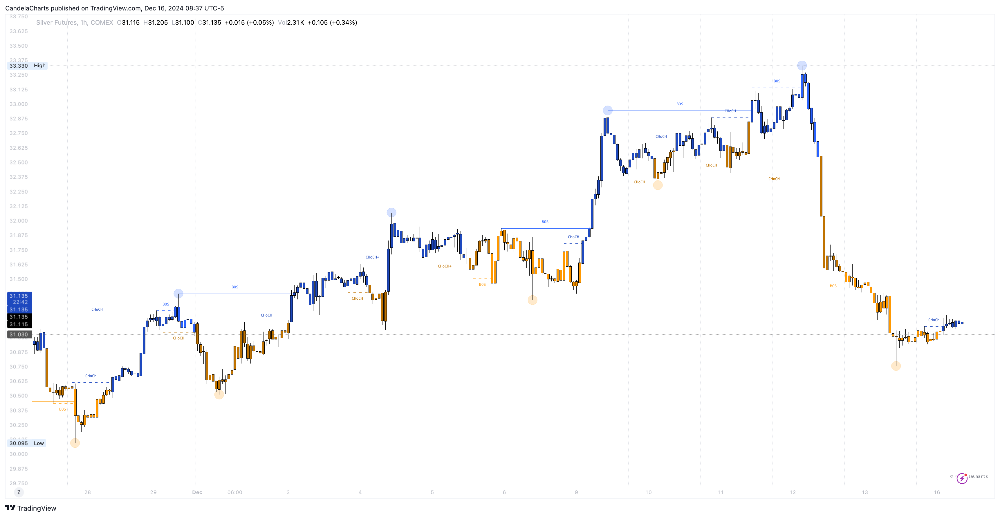
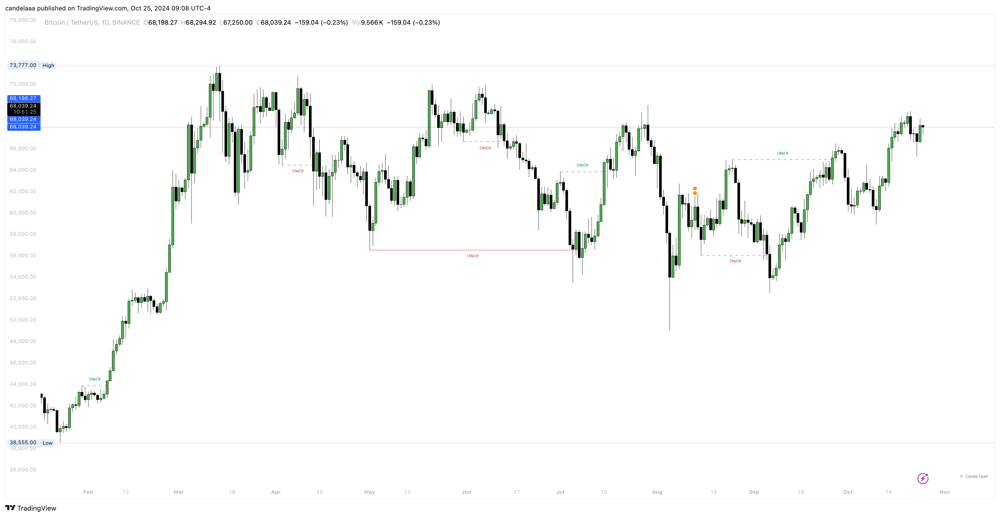
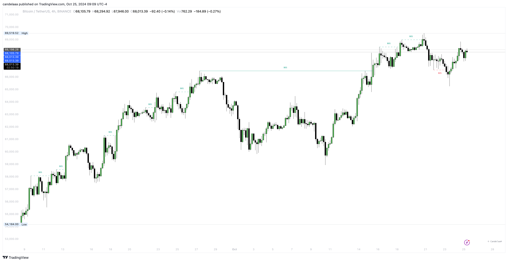

# Market Structure

<figure><figcaption></figcaption></figure>

Market structure is fundamental to understanding price action. The Price Action Toolkit™ automatically detects and highlights real-time market structure on your chart, providing a clear view of market trends without relying on traditional technical analysis tools like moving averages.

### Settings

<table><thead><tr><th>Name</th><th>Default</th><th>Options<select multiple><option value="kBm2BuKtzFwb" label="All" color="blue"></option><option value="6ONDsS4SDjdf" label="BOS" color="blue"></option><option value="v9alclMrAmTj" label="CHoCH" color="blue"></option><option value="qT5HUAoxVfOF" label="CHoCH+" color="blue"></option><option value="HezHcalp2SGp" label="Algorithmic" color="blue"></option><option value="kTPiyDR1x2xW" label="Adjusted" color="blue"></option><option value="T6TvRnpcPWw9" label="Circle" color="blue"></option><option value="nvtdwixwb4nT" label="Square" color="blue"></option><option value="gB0VfP6zuMaK" label="Diamond" color="blue"></option><option value="EUv1d0L0Ngc3" label="Cross" color="blue"></option><option value="l4VKHp35aIUb" label="xCross" color="blue"></option><option value="pX7JtiMouFOT" label="None" color="blue"></option></select></th></tr></thead><tbody><tr><td>Window</td><td>4000</td><td></td></tr><tr><td>Swing Points</td><td>Diamond</td><td>Circle, Square, Diamond, Cross, xCross, None</td></tr><tr><td>Swing</td><td>All | 50</td><td>All, BOS, CHoCH, CHoCH+</td></tr><tr><td>Internal</td><td>All | 5</td><td>All, BOS, CHoCH, CHoCH+</td></tr><tr><td>Mode</td><td>Adjusted</td><td>Algorithmic, Adjusted</td></tr><tr><td>Plot Candle</td><td>false</td><td></td></tr><tr><td>Bar Color</td><td>false</td><td></td></tr></tbody></table>

Market structure helps traders identify both trend reversals and continuations through two key signals:

* Change of Character (CHoCH)
* Break of Structure (BOS)

These concepts are explained in detail in the subsections below.

### Change Of Character (CHoCH)

A Change of Character (CHoCH), sometimes referred to as a "market structure shift," occurs when the price breaks a previous swing low in an uptrend (bullish CHoCH) or a previous swing high in a downtrend (bearish CHoCH), signaling a potential market reversal.

<figure><figcaption></figcaption></figure>

The Price Action Toolkit™ identifies two types of CHoCHs:

* **Leading CHoCH** (labeled as CHoCH): This occurs when there are no prior signs of reversal, such as a failed higher high (or lower high) in an uptrend, or a failed lower low (or higher low) in a downtrend.
* **Supported CHoCH** (labeled as CHoCH+): This is preceded by early signs of a market reversal, like a failed higher high (or lower high) in an uptrend or a failed lower low (or higher low) in a downtrend.

The distinction between the two lies in the relative position of prior swing highs or lows, providing different levels of confirmation for a potential trend change.


Users can choose to display either all types of CHoCHs or select specific ones using the drop-down menus in the Market Structure settings section of the toolkit.


### Break Of Structure (BOS)

A Break of Structure (BOS) primarily serves as a trend continuation signal. Unlike a CHoCH, a BOS occurs when the price breaks a previous swing high during an uptrend (bullish BOS), creating a new higher high, or breaks a previous swing low during a downtrend (bearish BOS), forming a new lower low. A BOS typically follows a CHoCH and indicates that the current trend is likely to continue.

It is common to see consecutive BOSs as they reinforce the ongoing trend.

<figure><figcaption></figcaption></figure>

### Swing & Internal Structure

The Smart Money Concepts toolkit provides two distinct dimensions for analyzing market structure:

1. **Internal Structure**
2. **Swing Structure**

**Internal Structure** is based on shorter-term swing highs and lows, while **Swing Structure** focuses on longer-term points. Users can customize the lookback period for detecting swing points in both internal and swing structures.

* **Internal Structures**: Use a lookback range of 5 to 49.
* **Swing Structures**: Use a lookback range of 50 to 100.

Internal Structures are highlighted with dashed lines and labeled in a smaller text size, differentiating them from the more prominent labels and lines used for Swing Structures.


The size of the labels for internal and swing structure can be changed from the **Theme** settings section.

