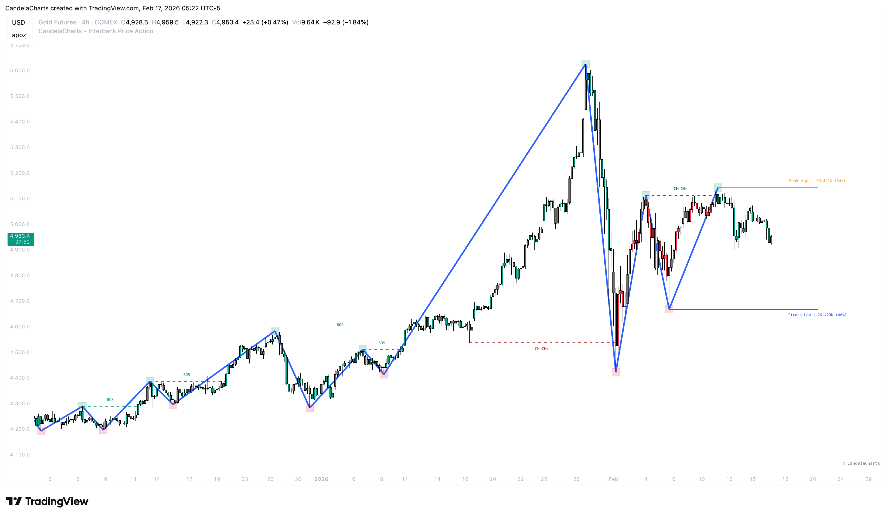
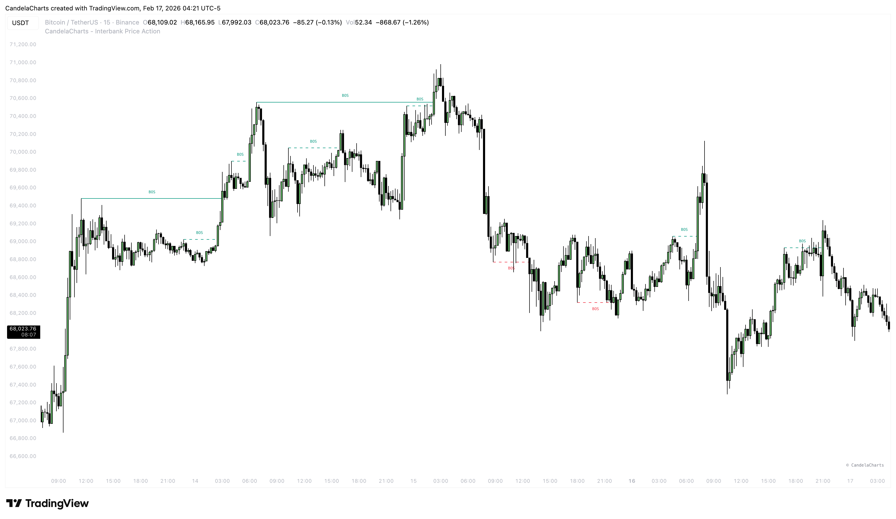
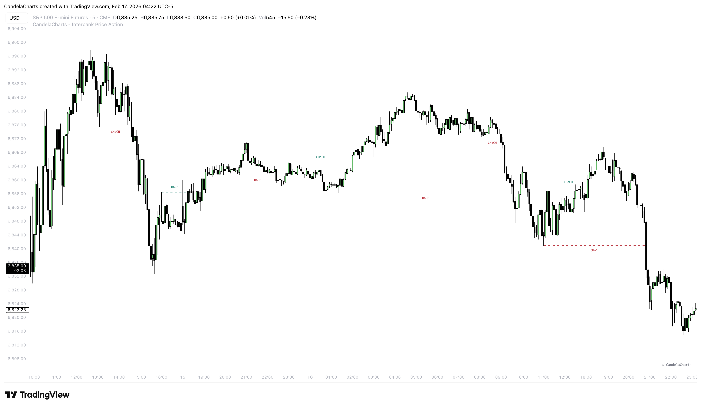
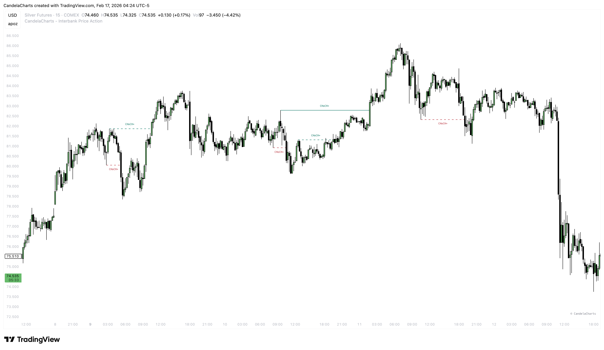
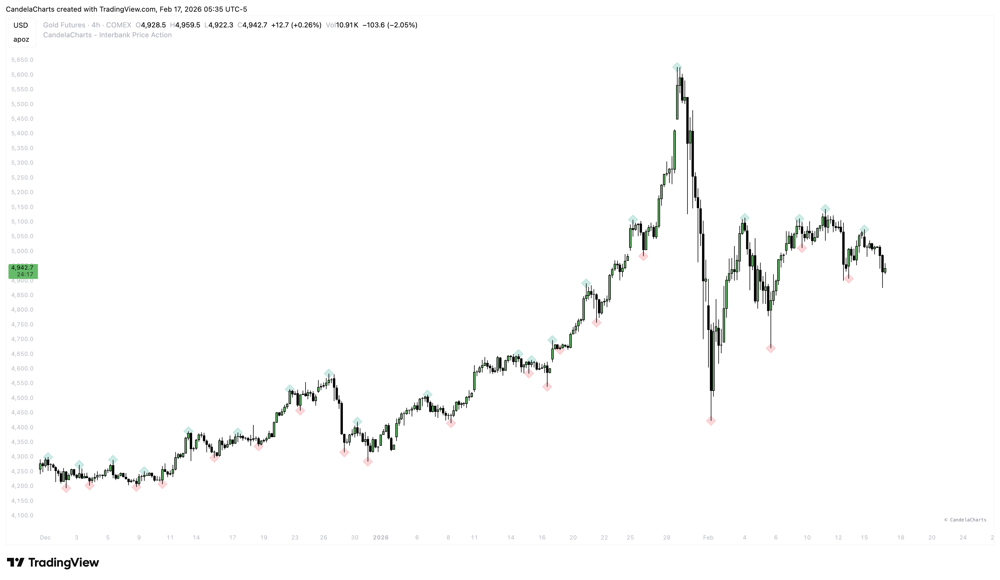
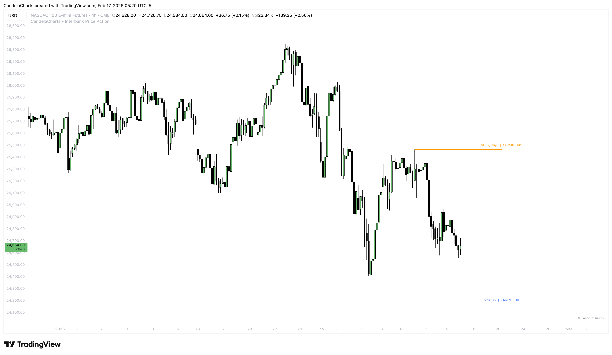

# Market Structure

### The Roadmap of Price 

**Market Structure** is the most fundamental concept in technical analysis. It tells you "who is winning" the battle between buyers and sellers. By objectively mapping out the Highs and Lows, you can trade _with_ the dominant flow rather than fighting against it.

<figure><figcaption></figcaption></figure>

This tool automates the tedious process of labeling structure, giving you a clean, objective map of the market in real-time.

### Structure Types 

We separate structure into two distinct layers to help you see both the "Big Picture" and the "Immediate Action."

#### 1. Macro Structure (Swing) 

* **Purpose**: Defines the overall trend bias (Daily/4H style structure).
* **Usage**: Trade in this direction. If Macro is Bullish, look for Longs.
* **Settings**: Controlled by `Macro Length`. A higher number (e.g., 50) filters out noise and shows main pivots.

#### 2. Micro Structure (Internal) 

* **Purpose**: Defines the short-term momentum (15m/5m style structure).
* **Usage**: Used for entries and early warning signals. A Micro CHoCH often precedes a Macro reversal.
* **Settings**: Controlled by `Micro Length`. A lower number (e.g., 5) catches every minor pullback.

### Structural Events 

We automatically detect and label three key events:

#### **BOS (Break of Structure)** 

<figure><figcaption></figcaption></figure>

* **Meaning**: Trend Continuation.
* **Bullish BOS**: Price breaks above a Higher High. The uptrend is healthy.
* **Bearish BOS**: Price breaks below a Lower Low. The downtrend is healthy.

#### **CHoCH (Change of Character)** 

<figure><figcaption></figcaption></figure>

* **Meaning**: The _first_ sign of a potential reversal.
* **Bullish CHoCH**: Price breaks above the last Lower High. The downtrend might be ending.
* **Bearish CHoCH**: Price breaks below the last Higher Low. The uptrend might be ending.

#### **CHoCH+ (Confirmed Change)** 

<figure><figcaption></figcaption></figure>

* **Meaning**: A higher-probability reversal signal.
* **Logic**: Standard CHoCH can be triggered by a wick. **CHoCH+** requires a **candle close** beyond the structural level to confirm the breakout.

### Visualizing the Swings 

#### Zigzag 

<figure><figcaption></figcaption></figure>

Connects the Highs and Lows with a line.

* **Benefit**: Instantly visualize the "Wave" of the market. See impulsive moves vs. corrective moves at a glance.

#### Swing Points 

<figure><figcaption></figcaption></figure>

Labels the specific pivots with symbols.

* **HH / HL**: Higher High / Higher Low.
* **LH / LL**: Lower High / Lower Low.
* **Customization**: You can change the shape (Circle, Square, Diamond) to fit your aesthetic.

### Strong vs. Weak Highs/Lows 

This is a powerful concept for placing Stop Losses and Take Profits.

<figure><figcaption></figcaption></figure>

#### **Strong High/Low**  

* **Definition**: A pivot that **caused a Break of Structure**.
  * _Example_: A High that pushed price down to make a new Low.
* **Psychology**: Institutions defended this level and pushed price aggressively. It is likely to hold again.
* **Action**: **Place your Stop Loss here.** It is a safe invalidated point.

#### **Weak High/Low**  

* **Definition**: A pivot that **failed to break structure**.
  * _Example_: A High that failed to make a new Low and price reversed.
* **Psychology**: This level failed to do its job. It is "weak." behaviorally, price often returns to "sweep" these levels for liquidity.
* **Action**: **Target this for Take Profit.** Price is likely to trade through it.
