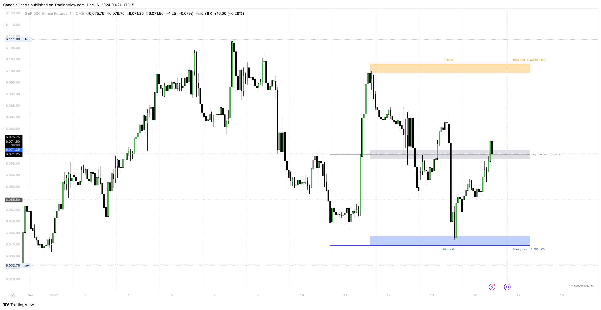

# Premium & Discount

<figure><figcaption></figcaption></figure>

Premium and Discount Zones identify and highlight three distinct price regions on a chart:

1. **Premium Zone**: This upper area represents higher price levels where assets are considered to be overvalued. Traders often look to sell or take profits in this zone, as prices are above the perceived fair value.
2. **Equilibrium Zone**: This central area marks the middle ground between the premium and discount zones. It reflects the fair market value where supply and demand are balanced. Traders may find it advantageous to enter trades or adjust positions in this zone.
3. **Discount Zone**: This lower area indicates lower price levels where assets are perceived as undervalued. It is often seen as a buying opportunity, as prices are below their fair value and may present potential for upward movement.

These zones help traders make informed decisions by visualizing where prices stand relative to their perceived value and can guide strategies for entry, exit, and position management.

### Settings

<table><thead><tr><th>Name</th><th>Default</th><th>Options<select multiple><option value="VCr45ehYrqxN" label="Area" color="blue"></option><option value="OsqWUc9HwEkO" label="Line" color="blue"></option><option value="3RsaEmBHrMG0" label="Square" color="blue"></option><option value="18pBT2E1KTDM" label="Circle" color="blue"></option><option value="eIqLzTftGA0L" label="Diamond" color="blue"></option><option value="5bgDmKiG6mfw" label="Cross" color="blue"></option><option value="MhfZUyiGXZ9g" label="xCross" color="blue"></option><option value="JOlgk7xSlREU" label="None" color="blue"></option></select></th></tr></thead><tbody><tr><td>Premium &#x26; Discount</td><td>false</td><td></td></tr><tr><td>Show Equilibrium</td><td>false</td><td></td></tr><tr><td>Show Strong/Weak High/Low </td><td>false</td><td></td></tr><tr><td>Mode</td><td>Area</td><td>Area, Line</td></tr></tbody></table>

These zones help traders determine if an event is taking place in a premium, discount, or equilibrium area.

Additionally, each area can be used as a support or resistance.


If an uptrend signal appears within a discount zone, it is more likely to trigger a reversal. Similarly, a downtrend signal within a premium zone has a higher chance of indicating a reversal.

