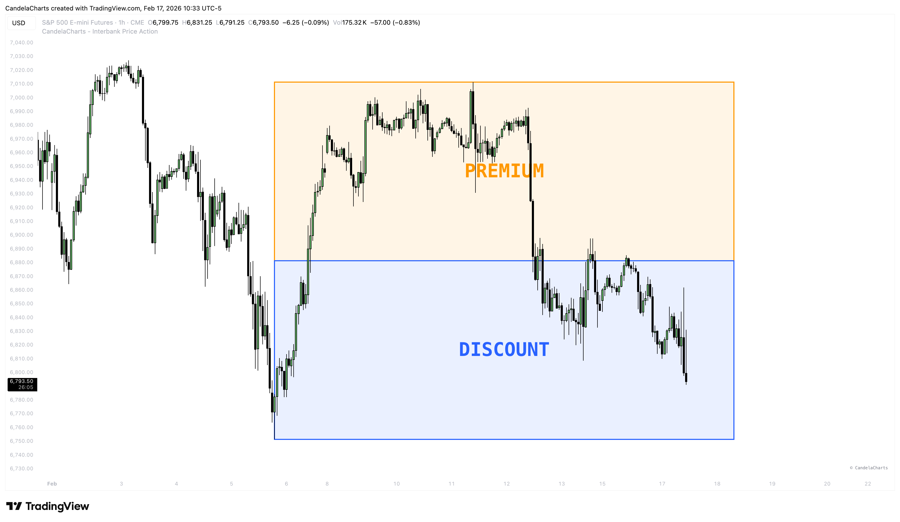
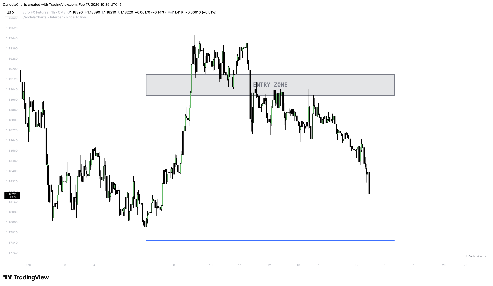
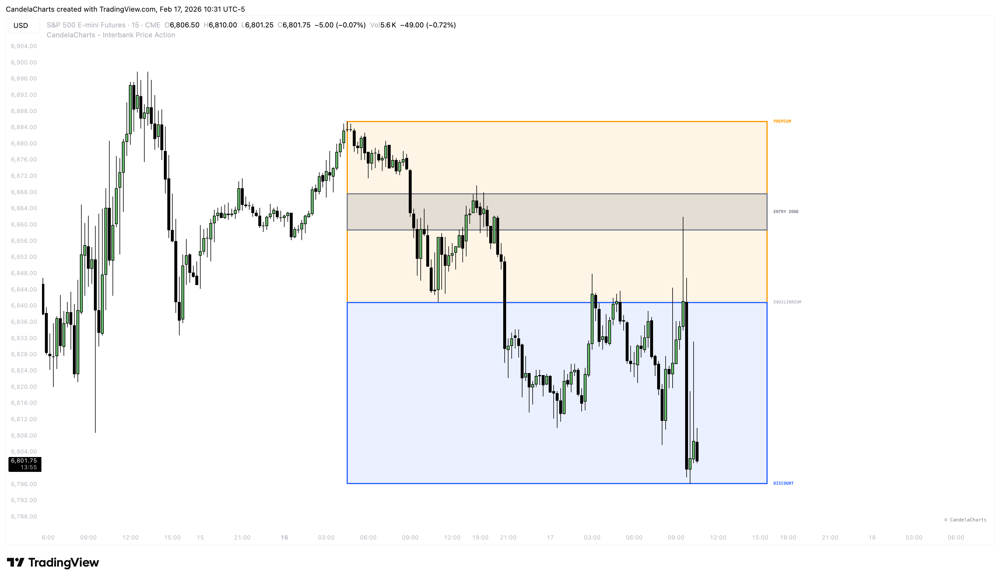
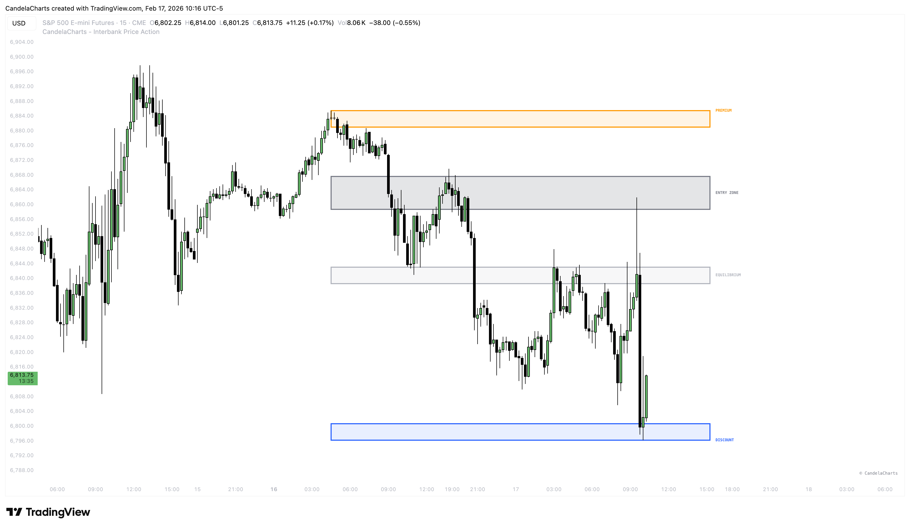
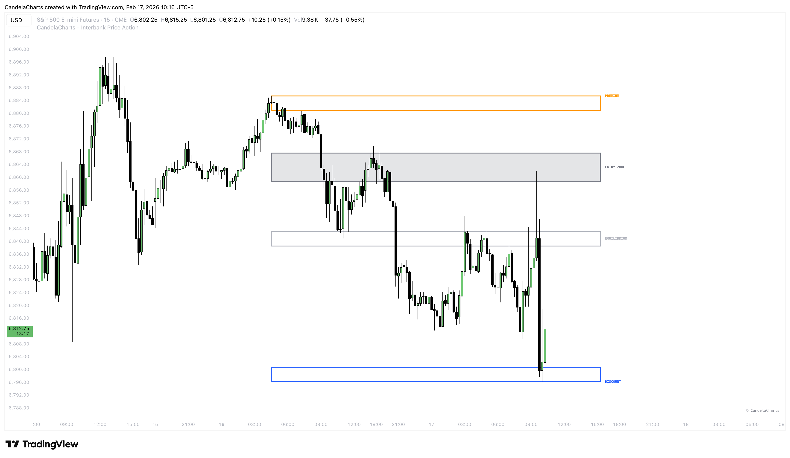
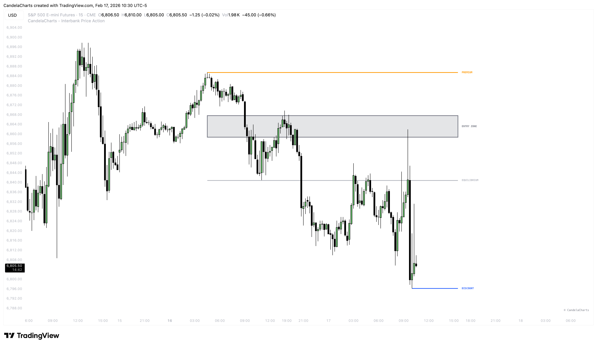

# Premium & Discount

### Dealing Range Analysis 

To consistently make profitable trades, you need to buy low (cheap) and sell high (expensive). In institutional trading, this concept is formalized as **Premium** and **Discount** zones within a **Dealing Range**.

<figure><figcaption></figcaption></figure>

This tool acts as your automated "valuation" scanner, ensuring you never buy at the top or sell at the bottom.

### The Zones 

The indicator identifies the current **Trading Range** defined by the most recent major Swing High and Swing Low.

* **Premium Zone (Top 50%)**: 🔴
  * _Status_: Expensive.
  * _Action_: Prioritize **Short** setups. Institutions are looking to offload positions here.
* **Discount Zone (Bottom 50%)**: 🟢
  * _Status_: Cheap.
  * _Action_: Prioritize **Long** setups. Institutions are looking to accumulate positions here.
* **Equilibrium (50% Level)**:
  * _Status_: Fair Value.
  * _Action_: Price often consolidates around this level before choosing a direction.

### Optimal Trade Entry (OTE) 

Within the Premium or Discount zones, we highlight a specific "sweet spot" (typically the 70-79% retracement). This is high-probability reversal area where risk-to-reward is maximized.

<figure><figcaption></figcaption></figure>

### Visual Customization 

Choose the aesthetic that fits your charting style:

* **Classic**: Distinctly colored zones (Red for Premium, Green for Discount). Best for beginners.

<figure><figcaption></figcaption></figure>

* **Modern**: Sleek, minimalist shading that blends into the background.

<figure><figcaption></figcaption></figure>

* **Minimalist**: Only draws the critical levels (0, 0.5, 1) without background fills.

<figure><figcaption></figcaption></figure>

* **Simple**: Just the range boundaries.

<figure><figcaption></figcaption></figure>
