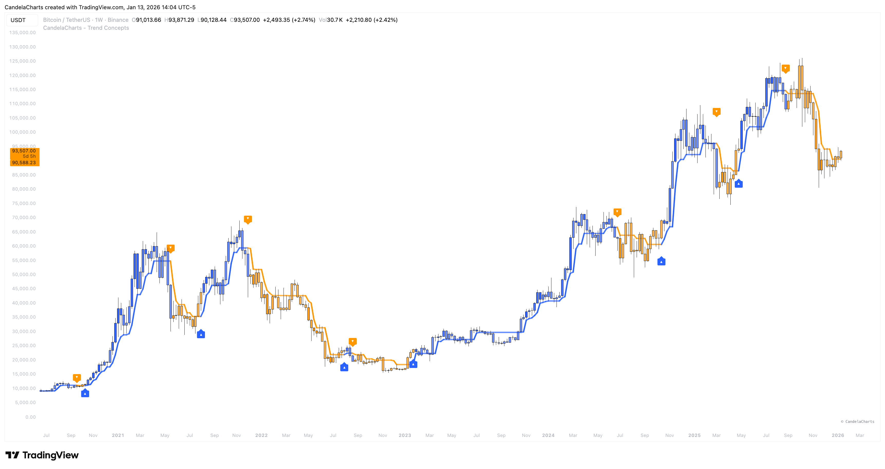

# Candle Coloring

<figure><figcaption></figcaption></figure>

Trend-based candle coloring mode changes the color of candlesticks depending on the current market trend, helping traders visually distinguish between bullish and bearish phases and neutral periods.

This mode is beneficial for trend-following strategies, allowing traders to quickly assess the overall market direction and align their trades with the prevailing trend.
