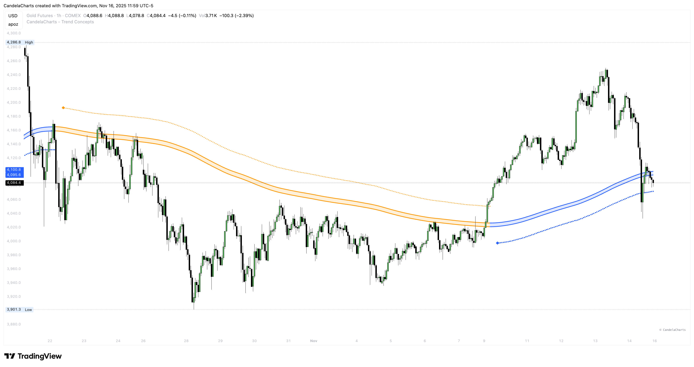

# Surge Waves

<figure><figcaption></figcaption></figure>

**Surge Waves** uses a two-pole filter to smooth price action and detect sustained momentum runs. It identifies when price is making strong directional moves by tracking consecutive bars in the same direction, making it ideal for catching momentum-based trading opportunities.

### How It Works

Surge Waves applies a two-pole filter (a type of low-pass filter) to price data, which:

* Smooths out noise and minor price fluctuations
* Preserves the underlying trend direction
* Tracks consecutive rising or falling bars
* Detects sustained runs of 5+ bars in the same direction

The filtered line is displayed within a filled tube envelope that provides visual context for momentum direction.

#### Key Features

### Two-Pole Filter

The filter smooths price action using a mathematical approach that:

* Reduces lag compared to simple moving averages
* Maintains responsiveness to trend changes
* Filters out market noise effectively

### Filled Tube Envelope

A colored tube surrounds the filter line:

* **Green tube**: Bullish momentum (filter is rising)
* **Red tube**: Bearish momentum (filter is falling)

The tube width is adjustable and based on ATR, making it adaptive to market volatility.

### Sustained Run Detection

Surge Waves tracks consecutive bars:

* **Rising bars**: Counts how many consecutive bars the filter is rising
* **Falling bars**: Counts how many consecutive bars the filter is falling

When a run reaches 5+ consecutive bars, it's considered a sustained momentum move.

### Visual Markers

* **Square shape**: Marks sustained rising runs (bullish momentum)
* **Diamond shape**: Marks sustained falling runs (bearish momentum)
* **Small diamond signals**: Confirmation signals when runs begin (appear on the bar where the run reaches 5 bars)
