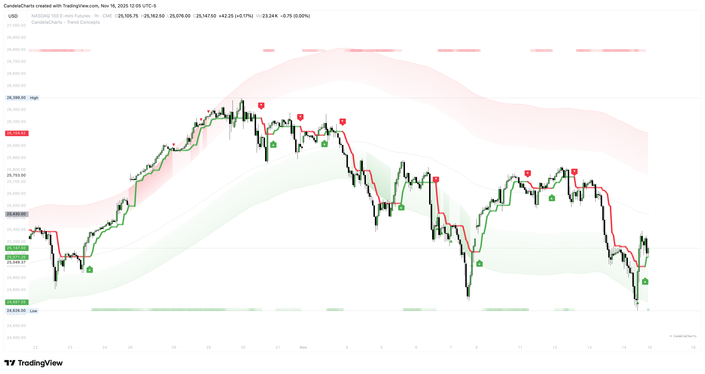
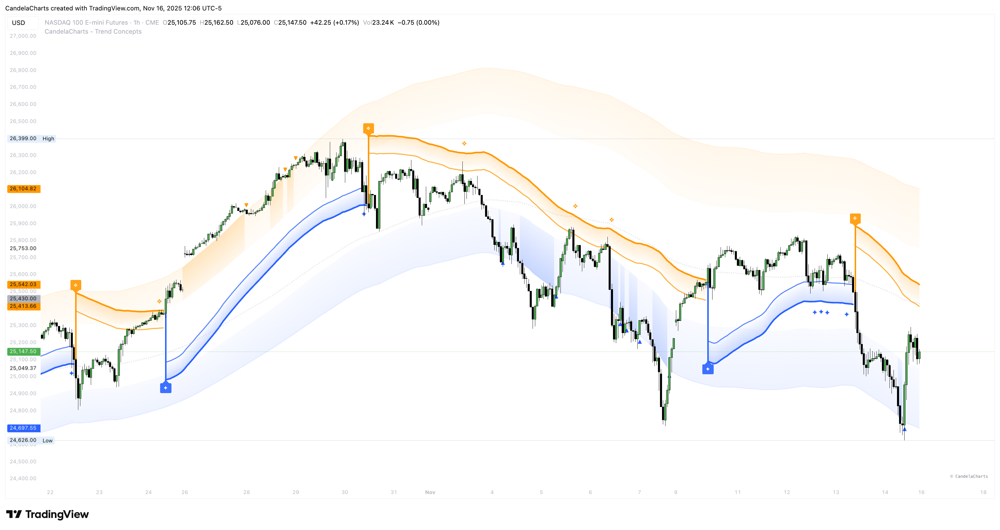
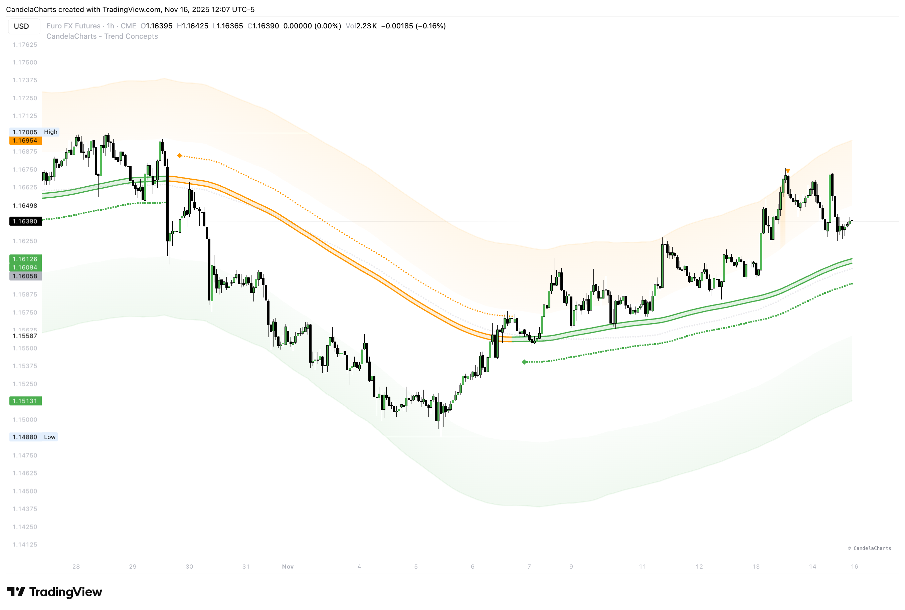
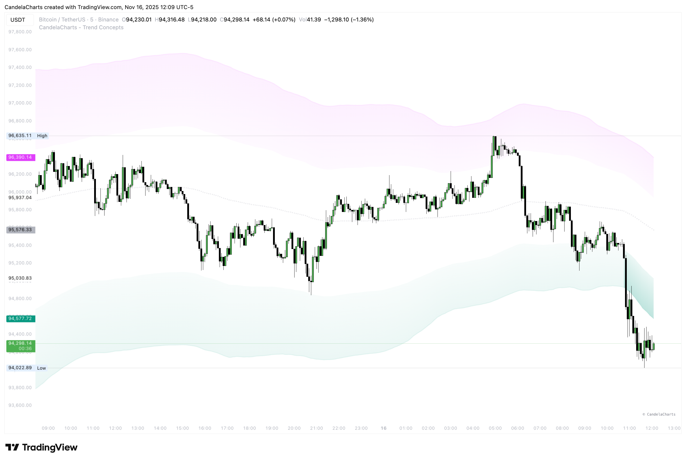
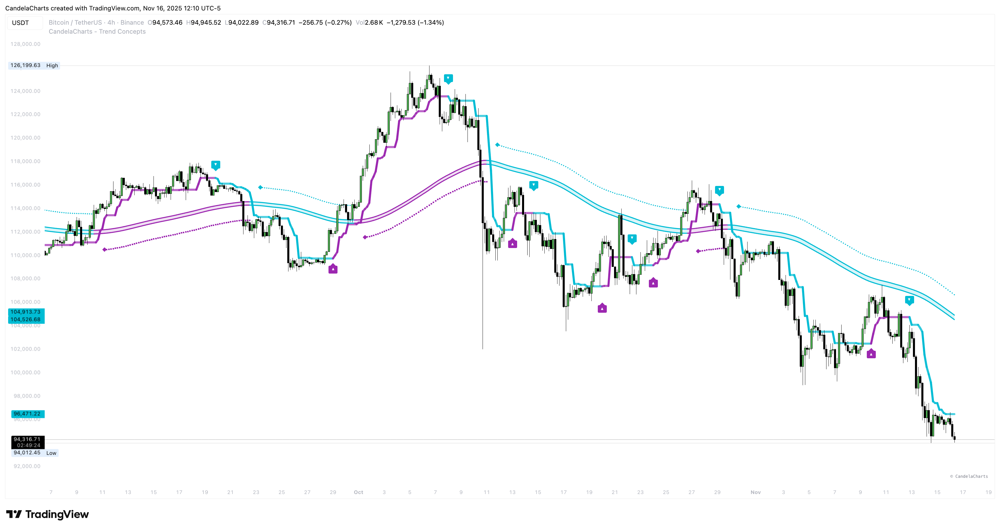
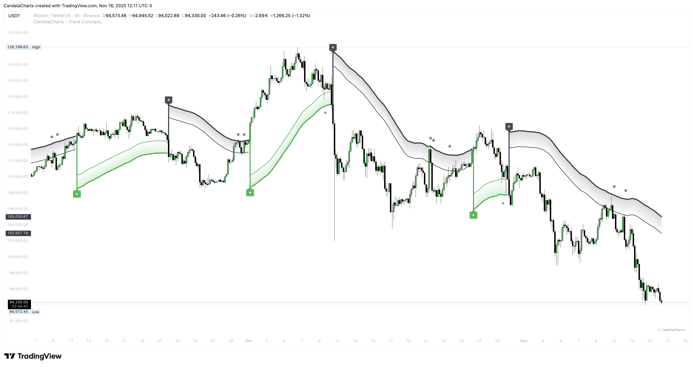

# Themes

Trend Concepts offers multiple color themes to customize the visual appearance of all components. Themes apply consistently across Bias Magnet, Flux Trend, Surge Waves, and Velocity Bands, creating a cohesive visual experience.

### Available Themes

#### Default

<figure><figcaption></figcaption></figure>

**Colors:** Red (bearish), Orange (range), Green (bullish)

The classic color scheme that's easy to read and familiar to most traders. Red for bearish, green for bullish provides clear visual distinction.

#### Blue - Orange

<figure><figcaption></figcaption></figure>

**Colors:** Orange (bearish), Yellow (range), Blue (bullish)

A softer color palette with blue representing bullish moves and orange for bearish. Good for traders who prefer less aggressive colors.

#### Green - Orange

<figure><figcaption></figcaption></figure>

**Colors:** Orange (bearish), Orange (range), Green (bullish)

Uses green for bullish and orange for bearish. The orange range color provides good contrast against both directions.

#### Teal - Fuchsia

<figure><figcaption></figcaption></figure>

**Colors:** Fuchsia (bearish), Gray (range), Teal (bullish)

A modern, vibrant color scheme. Teal for bullish and fuchsia for bearish creates a distinctive look.

#### Aqua - Purple

<figure><figcaption></figcaption></figure>

**Colors:** Aqua (bearish), Orange (range), Purple (bullish)

Unique color combination with purple for bullish and aqua for bearish. The orange range provides good separation.

#### Black - Green

<figure><figcaption></figcaption></figure>

**Colors:** Black (bearish), Light Gray (range), Green (bullish)

Minimalist theme with black for bearish and green for bullish. Good for traders who prefer subtle colors.

#### Black - Aqua

<figure><figcaption></figcaption></figure>

**Colors:** Black (bearish), Light Gray (range), Aqua (bullish)

Similar to Black-Green but with aqua for bullish moves. Provides a clean, professional appearance.

#### Custom

When Custom is selected, you can define your own colors:

* **Bull Color**: Color for bullish/up trend elements
* **Range Color**: Color for neutral/consolidation elements (if applicable)
* **Bear Color**: Color for bearish/down trend elements
